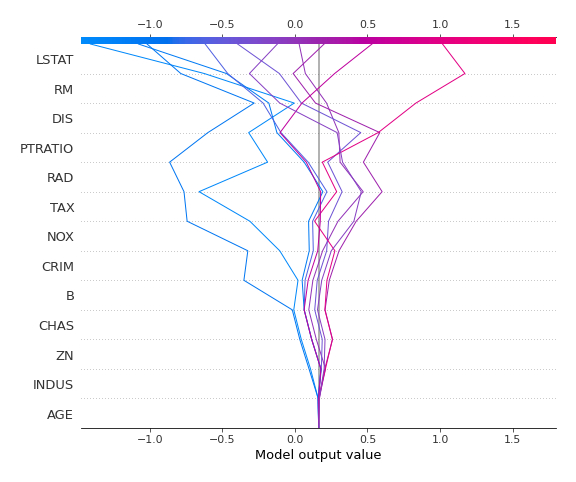

# Summary of 3_Linear

[<< Go back](../README.md)

## Linear Regression (Linear)
- **n_jobs**: -1
- **explain_level**: 2

## Validation
 - **validation_type**: split
 - **train_ratio**: 0.75
 - **shuffle**: True

## Optimized metric
rmse

## Training time

7.0 seconds

### Metric details:
| Metric   |     Score |
|:---------|----------:|
| MAE      |  3.52363  |
| MSE      | 30.9421   |
| RMSE     |  5.56256  |
| R2       |  0.681051 |
| MAPE     |  0.187837 |

## Learning curves

## Coefficients
| feature   |   Learner_1 |
|:----------|------------:|
| CHAS      |  0.397986   |
| RM        |  0.322976   |
| RAD       |  0.261844   |
| ZN        |  0.130801   |
| B         |  0.109031   |
| AGE       | -0.00327079 |
| intercept | -0.0275832  |
| INDUS     | -0.050367   |
| NOX       | -0.14498    |
| PTRATIO   | -0.150847   |
| CRIM      | -0.164443   |
| TAX       | -0.211143   |
| DIS       | -0.329154   |
| LSTAT     | -0.405136   |

## Permutation-based Importance

## True vs Predicted

## Predicted vs Residuals

## SHAP Importance

## SHAP Dependence plots

### Dependence (Fold 1)

## SHAP Decision plots

### Top-10 Worst decisions (Fold 1)

### Top-10 Best decisions (Fold 1)

[<< Go back](../README.md)
