# Exploratory Data Analysis

[<< Go back](../README.md)
## Feature : target
- **Feature type** : continous
- **Missing** : 0.0%
- **Unique** : 201
- **Count** :404.0
- **Mean** :21.84183168316832
- **Std** :8.783610816123273
- **Min** :5.0
- **25%th Percentile** : 16.375
- **50%th Percentile** : 20.6
- **75%th Percentile** : 24.625
- **Max** :50.0

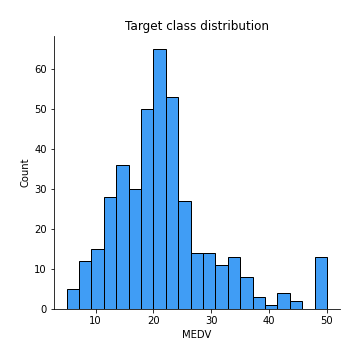
## Feature : CRIM
- **Feature type** : continous
- **Missing** : 0.0%
- **Unique** : 403
- **Count** :404.0
- **Mean** :3.9092950742574257
- **Std** :9.096069652900429
- **Min** :0.00632
- **25%th Percentile** : 0.0834375
- **50%th Percentile** : 0.284585
- **75%th Percentile** : 4.25399
- **Max** :88.9762

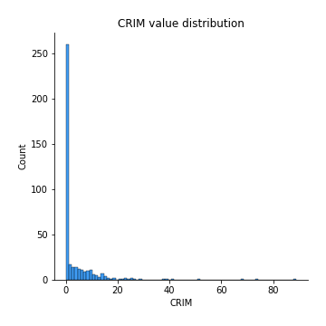
## Feature : ZN
- **Feature type** : continous
- **Missing** : 0.0%
- **Unique** : 26
- **Count** :404.0
- **Mean** :11.246287128712872
- **Std** :23.7508649146777
- **Min** :0.0
- **25%th Percentile** : 0.0
- **50%th Percentile** : 0.0
- **75%th Percentile** : 12.5
- **Max** :100.0

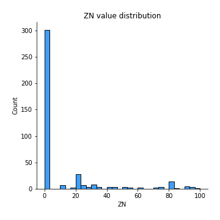
## Feature : INDUS
- **Feature type** : continous
- **Missing** : 0.0%
- **Unique** : 73
- **Count** :404.0
- **Mean** :11.546039603960397
- **Std** :6.963179421143267
- **Min** :0.46
- **25%th Percentile** : 5.32
- **50%th Percentile** : 9.9
- **75%th Percentile** : 18.1
- **Max** :27.74

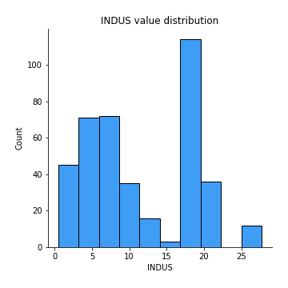
## Feature : CHAS
- **Feature type** : continous
- **Missing** : 0.0%
- **Unique** : 2
- **Count** :404.0
- **Mean** :0.06683168316831684
- **Std** :0.25003992015993504
- **Min** :0.0
- **25%th Percentile** : 0.0
- **50%th Percentile** : 0.0
- **75%th Percentile** : 0.0
- **Max** :1.0

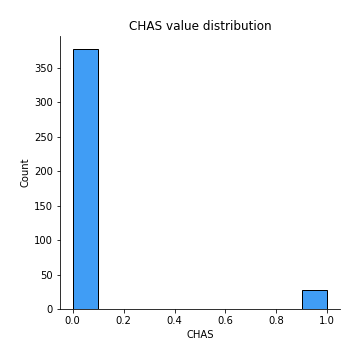
## Feature : NOX
- **Feature type** : continous
- **Missing** : 0.0%
- **Unique** : 80
- **Count** :404.0
- **Mean** :0.558670792079208
- **Std** :0.11777134420982431
- **Min** :0.385
- **25%th Percentile** : 0.449
- **50%th Percentile** : 0.538
- **75%th Percentile** : 0.631
- **Max** :0.871

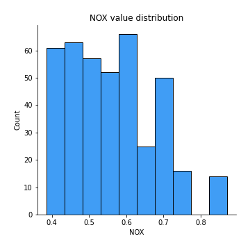
## Feature : RM
- **Feature type** : continous
- **Missing** : 0.0%
- **Unique** : 365
- **Count** :404.0
- **Mean** :6.239108910891089
- **Std** :0.6720255504564575
- **Min** :3.561
- **25%th Percentile** : 5.87475
- **50%th Percentile** : 6.1635
- **75%th Percentile** : 6.569
- **Max** :8.78

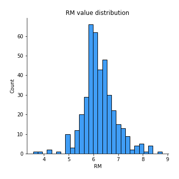
## Feature : AGE
- **Feature type** : continous
- **Missing** : 0.0%
- **Unique** : 296
- **Count** :404.0
- **Mean** :69.21806930693069
- **Std** :27.955163414362662
- **Min** :2.9
- **25%th Percentile** : 45.675000000000004
- **50%th Percentile** : 77.5
- **75%th Percentile** : 94.6
- **Max** :100.0

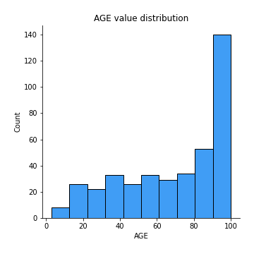
## Feature : DIS
- **Feature type** : continous
- **Missing** : 0.0%
- **Unique** : 342
- **Count** :404.0
- **Mean** :3.7612900990099005
- **Std** :2.1319020035883938
- **Min** :1.137
- **25%th Percentile** : 2.0446
- **50%th Percentile** : 3.1322
- **75%th Percentile** : 5.0356749999999995
- **Max** :12.1265

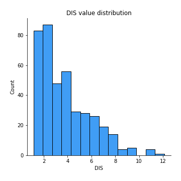
## Feature : RAD
- **Feature type** : continous
- **Missing** : 0.0%
- **Unique** : 9
- **Count** :404.0
- **Mean** :9.935643564356436
- **Std** :8.928212002410298
- **Min** :1.0
- **25%th Percentile** : 4.0
- **50%th Percentile** : 5.0
- **75%th Percentile** : 24.0
- **Max** :24.0

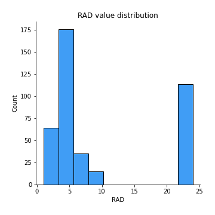
## Feature : TAX
- **Feature type** : continous
- **Missing** : 0.0%
- **Unique** : 63
- **Count** :404.0
- **Mean** :417.23267326732673
- **Std** :172.21550156544097
- **Min** :187.0
- **25%th Percentile** : 280.75
- **50%th Percentile** : 345.0
- **75%th Percentile** : 666.0
- **Max** :711.0

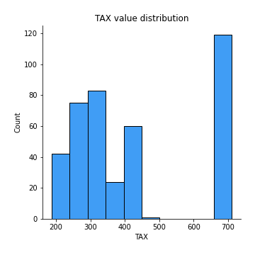
## Feature : PTRATIO
- **Feature type** : continous
- **Missing** : 0.0%
- **Unique** : 45
- **Count** :404.0
- **Mean** :18.550990099009898
- **Std** :2.142011301738433
- **Min** :12.6
- **25%th Percentile** : 17.4
- **50%th Percentile** : 19.1
- **75%th Percentile** : 20.2
- **Max** :22.0

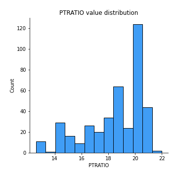
## Feature : B
- **Feature type** : continous
- **Missing** : 0.0%
- **Unique** : 295
- **Count** :404.0
- **Mean** :353.5539603960396
- **Std** :95.48314434107715
- **Min** :0.32
- **25%th Percentile** : 374.33500000000004
- **50%th Percentile** : 391.30499999999995
- **75%th Percentile** : 396.2325
- **Max** :396.9

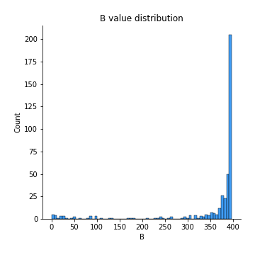
## Feature : LSTAT
- **Feature type** : continous
- **Missing** : 0.0%
- **Unique** : 374
- **Count** :404.0
- **Mean** :13.062277227722772
- **Std** :7.062023923645415
- **Min** :1.92
- **25%th Percentile** : 7.525
- **50%th Percentile** : 11.845
- **75%th Percentile** : 17.2725
- **Max** :37.97

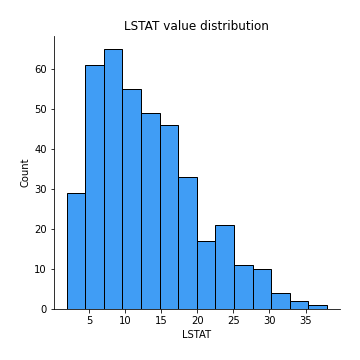

[<< Go back](../README.md)
