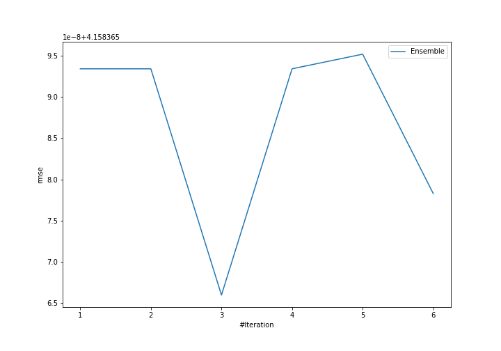
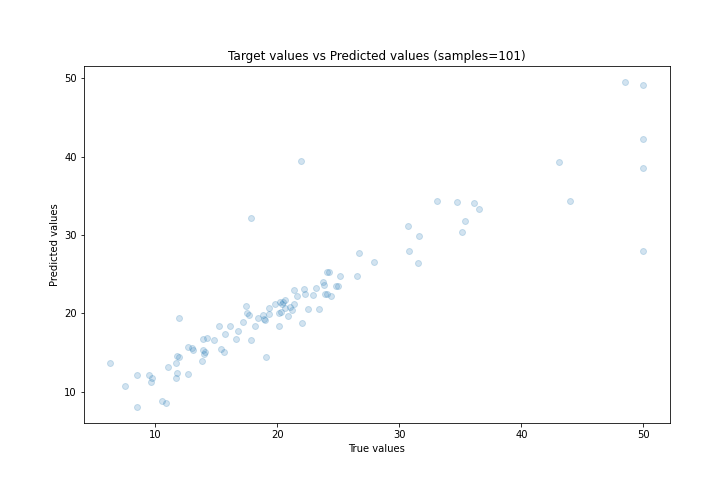
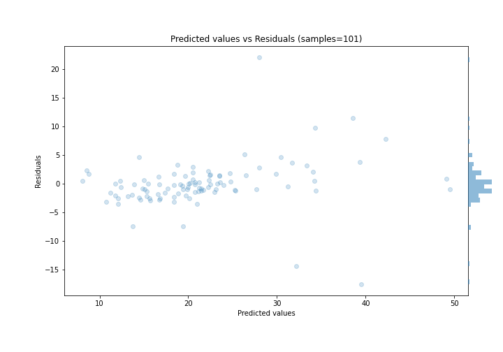

# Summary of Ensemble

[<< Go back](../README.md)

## Ensemble structure
| Model             |   Weight |
|:------------------|---------:|
| 4_Default_Xgboost |        3 |

### Metric details:
| Metric   |     Score |
|:---------|----------:|
| MAE      |  2.39405  |
| MSE      | 17.292    |
| RMSE     |  4.15837  |
| R2       |  0.821755 |
| MAPE     |  0.127348 |

## Learning curves

## True vs Predicted

## Predicted vs Residuals

[<< Go back](../README.md)
