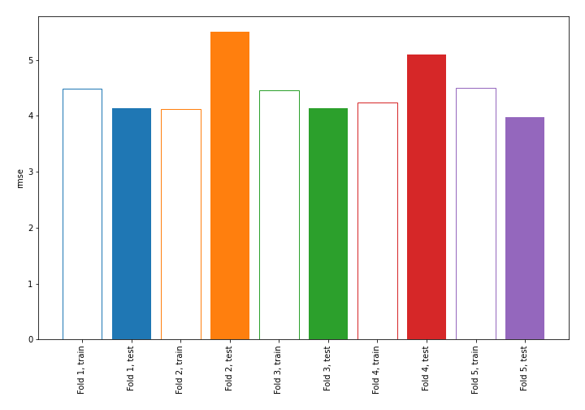
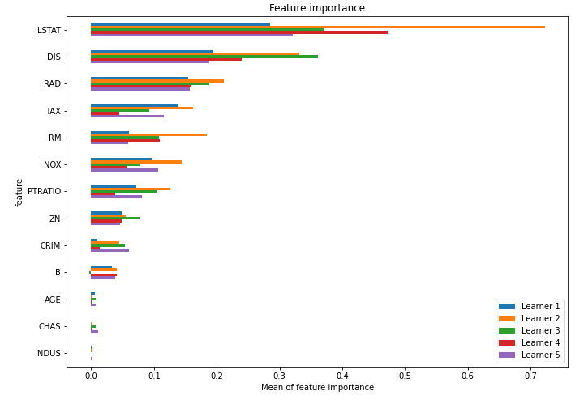
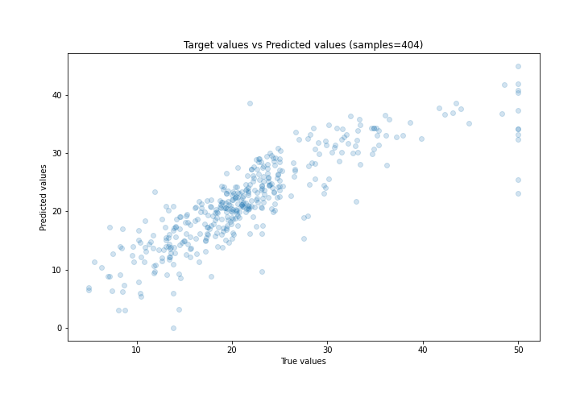
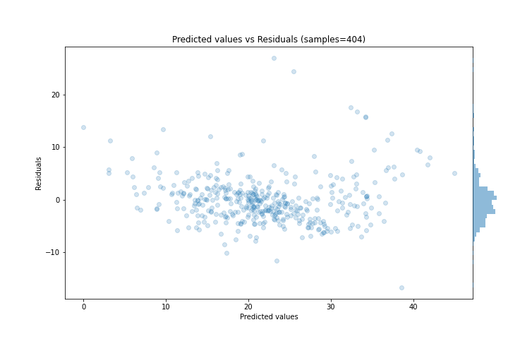

# Summary of 1_Linear

[<< Go back](../README.md)

## Linear Regression (Linear)
- **n_jobs**: -1
- **explain_level**: 1

## Validation
 - **validation_type**: kfold
 - **k_folds**: 5
 - **shuffle**: True

## Optimized metric
rmse

## Training time

7.2 seconds

### Metric details:
| Metric   |     Score |
|:---------|----------:|
| MAE      |  3.22949  |
| MSE      | 21.2874   |
| RMSE     |  4.61383  |
| R2       |  0.723399 |
| MAPE     |  0.165897 |

## Learning curves

## Coefficients
| feature   |   Learner_1 |   Learner_2 |   Learner_3 |   Learner_4 |   Learner_5 |
|:----------|------------:|------------:|------------:|------------:|------------:|
| RAD       |  0.315597   |  0.349414   |   0.311217  |   0.252464  |  0.310959   |
| RM        |  0.274371   |  0.161619   |   0.232708  |   0.298076  |  0.234299   |
| CHAS      |  0.335346   |  0.30466    |   0.162414  |   0.2532    |  0.123038   |
| ZN        |  0.159082   |  0.227884   |   0.167438  |   0.141243  |  0.157806   |
| B         |  0.125111   |  0.12991    |   0.147761  |   0.105812  |  0.117641   |
| AGE       |  0.0618406  |  0.0605686  |   0.0534587 |   0.0175681 |  0.0581077  |
| INDUS     |  0.00316263 | -0.00863593 |  -0.0112878 |  -0.022387  |  0.00559674 |
| intercept | -0.0155734  | -0.0226373  |  -0.0115651 |  -0.0203814 | -0.00759494 |
| CRIM      | -0.144808   | -0.140248   |  -0.134132  |  -0.143497  | -0.0949627  |
| PTRATIO   | -0.181411   | -0.218614   |  -0.196099  |  -0.208069  | -0.197866   |
| NOX       | -0.19952    | -0.251422   |  -0.219428  |  -0.19944   | -0.212913   |
| TAX       | -0.240616   | -0.264424   |  -0.225446  |  -0.193357  | -0.247575   |
| DIS       | -0.327621   | -0.406032   |  -0.363834  |  -0.339947  | -0.356471   |
| LSTAT     | -0.454519   | -0.497861   |  -0.468388  |  -0.40219   | -0.508864   |

## Permutation-based Importance

## True vs Predicted

## Predicted vs Residuals

[<< Go back](../README.md)
