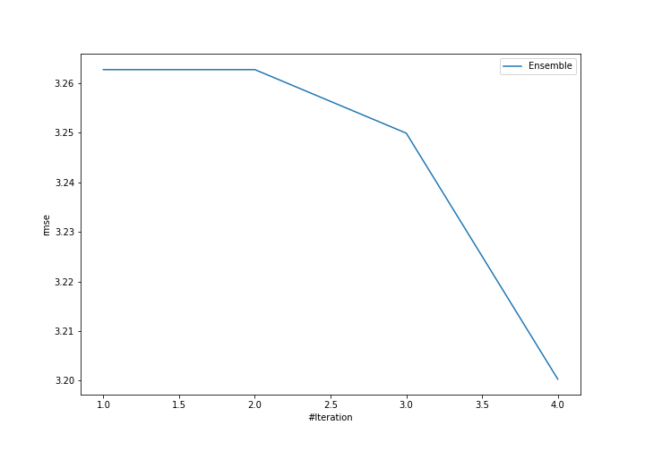
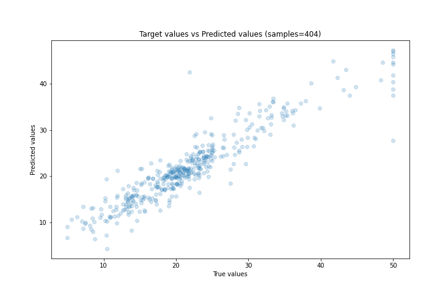
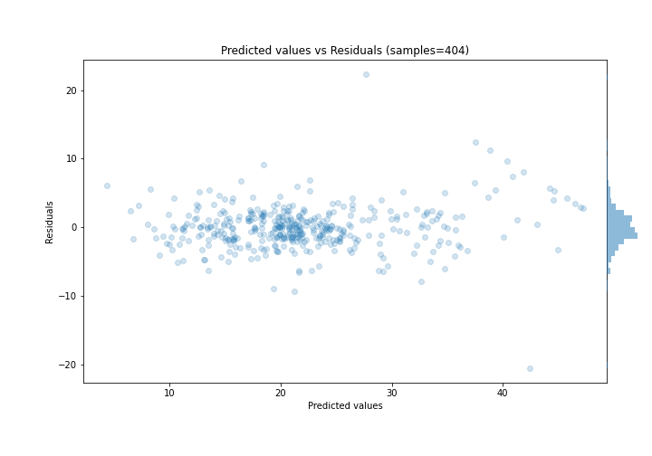

# Summary of Ensemble

[<< Go back](../README.md)

## Ensemble structure
| Model              |   Weight |
|:-------------------|---------:|
| 1_Linear           |        1 |
| 2_Default_LightGBM |        3 |

### Metric details:
| Metric   |     Score |
|:---------|----------:|
| MAE      |  2.18177  |
| MSE      | 10.242    |
| RMSE     |  3.20032  |
| R2       |  0.866919 |
| MAPE     |  0.115506 |

## Learning curves

## True vs Predicted

## Predicted vs Residuals

[<< Go back](../README.md)
