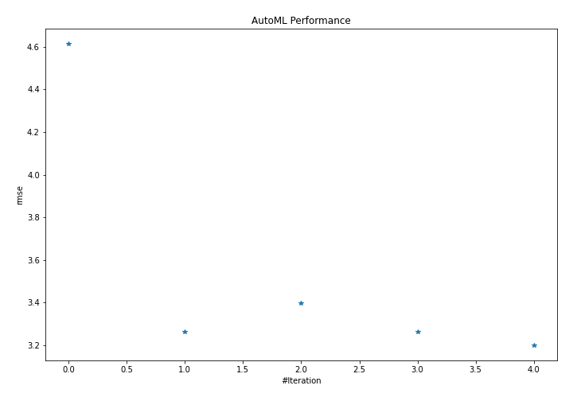
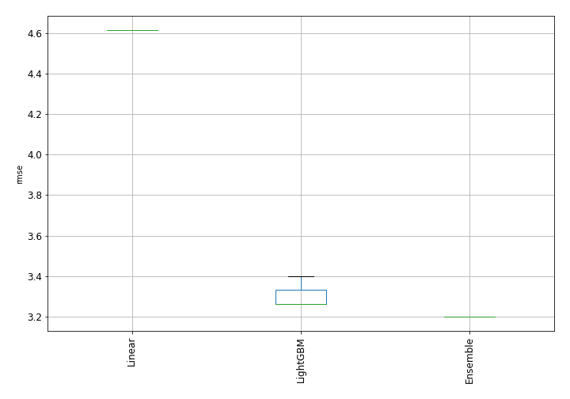
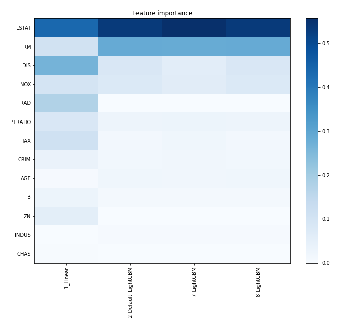
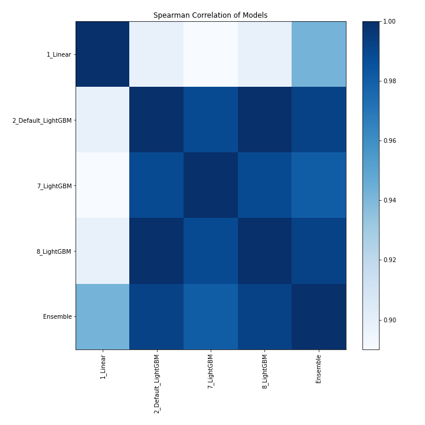

# AutoML Leaderboard

| Best model   | name                                               | model_type   | metric_type   |   metric_value |   train_time |   single_prediction_time |
|:-------------|:---------------------------------------------------|:-------------|:--------------|---------------:|-------------:|-------------------------:|
|              | [1_Linear](1_Linear/README.md)                     | Linear       | rmse          |        4.61383 |         9.9  |                   0.1703 |
|              | [2_Default_LightGBM](2_Default_LightGBM/README.md) | LightGBM     | rmse          |        3.26267 |        45.53 |                   0.0927 |
|              | [7_LightGBM](7_LightGBM/README.md)                 | LightGBM     | rmse          |        3.39944 |        34.62 |                   0.101  |
|              | [8_LightGBM](8_LightGBM/README.md)                 | LightGBM     | rmse          |        3.26267 |        47.73 |                   0.1073 |
| **the best** | [Ensemble](Ensemble/README.md)                     | Ensemble     | rmse          |        3.20032 |         0.63 |                   0.2844 |

### AutoML Performance

### AutoML Performance Boxplot

### Features Importance

### Spearman Correlation of Models

