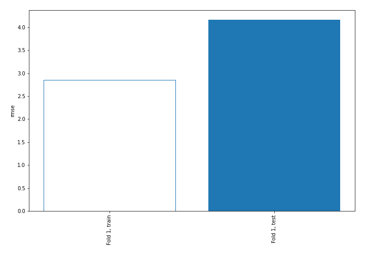
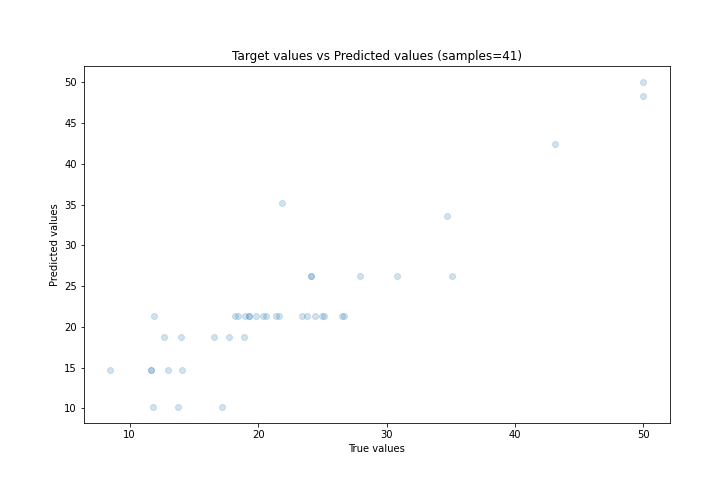
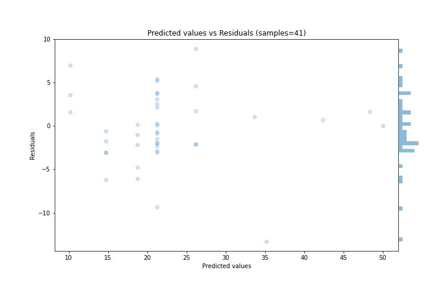

# Summary of 1_DecisionTree

[<< Go back](../README.md)

## Decision Tree
- **n_jobs**: -1
- **criterion**: mse
- **max_depth**: 4
- **explain_level**: 0

## Validation
 - **validation_type**: split
 - **train_ratio**: 0.9
 - **shuffle**: True

## Optimized metric
rmse

## Training time

1.1 seconds

### Metric details:
| Metric   |     Score |
|:---------|----------:|
| MAE      |  3.12209  |
| MSE      | 17.3284   |
| RMSE     |  4.16274  |
| R2       |  0.804868 |
| MAPE     |  0.175514 |

## Learning curves

## True vs Predicted

## Predicted vs Residuals

[<< Go back](../README.md)
