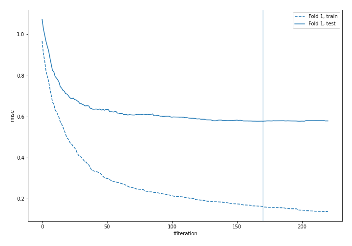
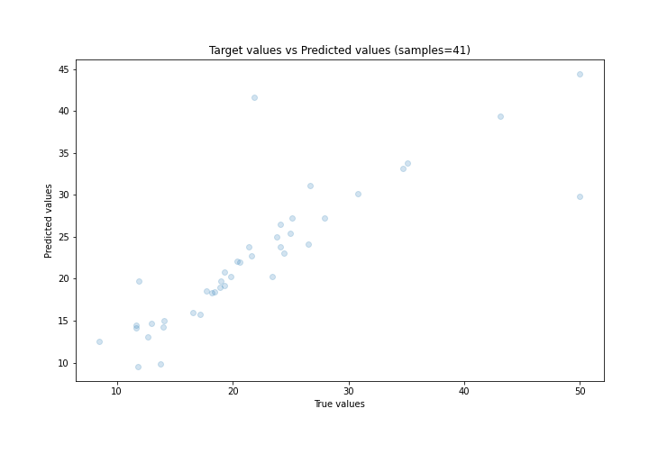
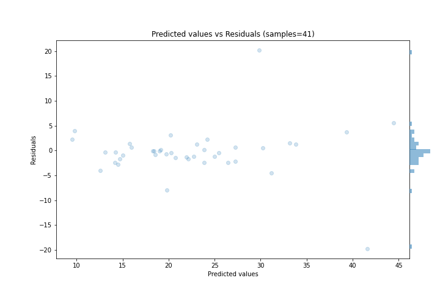

# Summary of 25_CatBoost

[<< Go back](../README.md)

## CatBoost
- **n_jobs**: -1
- **learning_rate**: 0.1
- **depth**: 7
- **rsm**: 1.0
- **loss_function**: MAPE
- **eval_metric**: RMSE
- **explain_level**: 0

## Validation
 - **validation_type**: split
 - **train_ratio**: 0.9
 - **shuffle**: True

## Optimized metric
rmse

## Training time

2.9 seconds

### Metric details:
| Metric   |     Score |
|:---------|----------:|
| MAE      |  2.68888  |
| MSE      | 25.1345   |
| RMSE     |  5.01343  |
| R2       |  0.716965 |
| MAPE     |  0.128967 |

## Learning curves

## True vs Predicted

## Predicted vs Residuals

[<< Go back](../README.md)
