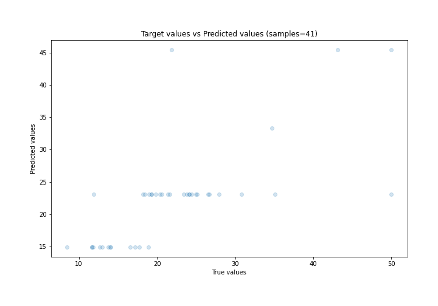

# Summary of 2_DecisionTree

[<< Go back](../README.md)

## Decision Tree
- **n_jobs**: -1
- **criterion**: mse
- **max_depth**: 2
- **explain_level**: 0

## Validation
 - **validation_type**: split
 - **train_ratio**: 0.9
 - **shuffle**: True

## Optimized metric
rmse

## Training time

1.0 seconds

### Metric details:
| Metric   |     Score |
|:---------|----------:|
| MAE      |  4.29974  |
| MSE      | 47.0281   |
| RMSE     |  6.85771  |
| R2       |  0.470425 |
| MAPE     |  0.207742 |

## Learning curves

## True vs Predicted

## Predicted vs Residuals

[<< Go back](../README.md)
