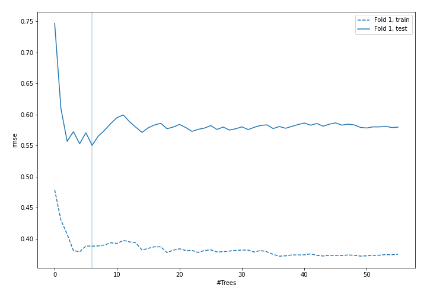
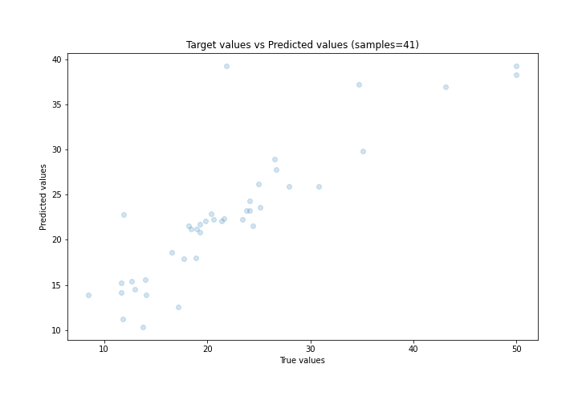
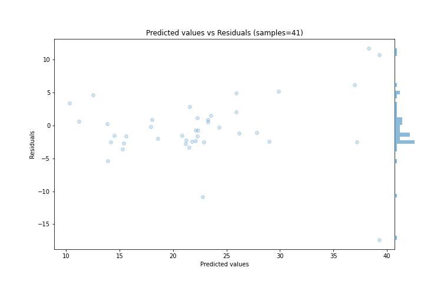

# Summary of 34_RandomForest

[<< Go back](../README.md)

## Random Forest
- **n_jobs**: -1
- **criterion**: mse
- **max_features**: 0.9
- **min_samples_split**: 40
- **max_depth**: 5
- **eval_metric_name**: rmse
- **explain_level**: 0

## Validation
 - **validation_type**: split
 - **train_ratio**: 0.9
 - **shuffle**: True

## Optimized metric
rmse

## Training time

3.1 seconds

### Metric details:
| Metric   |     Score |
|:---------|----------:|
| MAE      |  3.24115  |
| MSE      | 22.918    |
| RMSE     |  4.78728  |
| R2       |  0.741924 |
| MAPE     |  0.161795 |

## Learning curves

## True vs Predicted

## Predicted vs Residuals

[<< Go back](../README.md)
