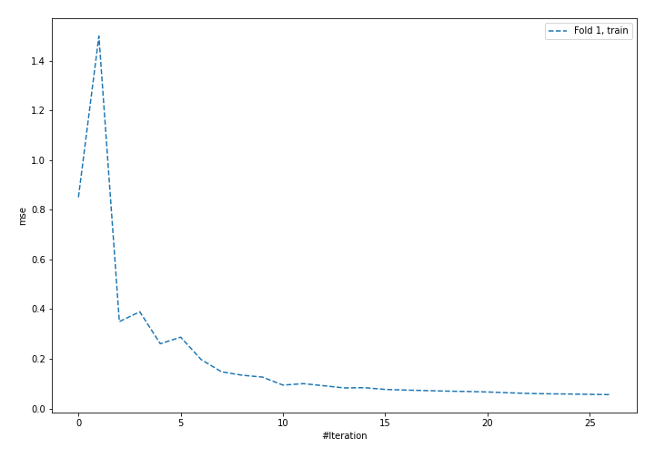
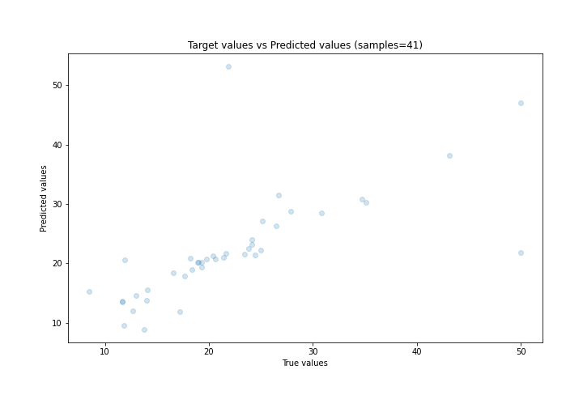
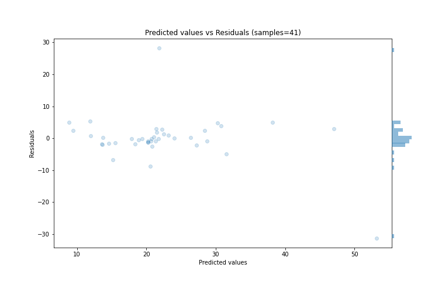

# Summary of 52_NeuralNetwork

[<< Go back](../README.md)

## Neural Network
- **n_jobs**: -1
- **dense_1_size**: 16
- **dense_2_size**: 32
- **learning_rate**: 0.08
- **explain_level**: 0

## Validation
 - **validation_type**: split
 - **train_ratio**: 0.9
 - **shuffle**: True

## Optimized metric
rmse

## Training time

1.2 seconds

### Metric details:
| Metric   |     Score |
|:---------|----------:|
| MAE      |  3.48752  |
| MSE      | 51.3933   |
| RMSE     |  7.16891  |
| R2       |  0.421269 |
| MAPE     |  0.165672 |

## Learning curves

## True vs Predicted

## Predicted vs Residuals

[<< Go back](../README.md)
