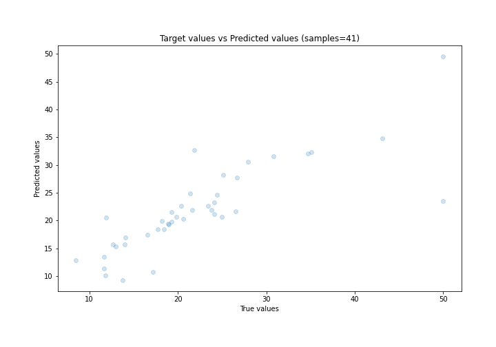

# Summary of 61_NearestNeighbors

[<< Go back](../README.md)

## k-Nearest Neighbors (Nearest Neighbors)
- **n_jobs**: -1
- **n_neighbors**: 3
- **weights**: distance
- **explain_level**: 0

## Validation
 - **validation_type**: split
 - **train_ratio**: 0.9
 - **shuffle**: True

## Optimized metric
rmse

## Training time

1.1 seconds

### Metric details:
| Metric   |     Score |
|:---------|----------:|
| MAE      |  3.10352  |
| MSE      | 29.1858   |
| RMSE     |  5.40239  |
| R2       |  0.671344 |
| MAPE     |  0.147737 |

## Learning curves

## True vs Predicted

## Predicted vs Residuals

[<< Go back](../README.md)
