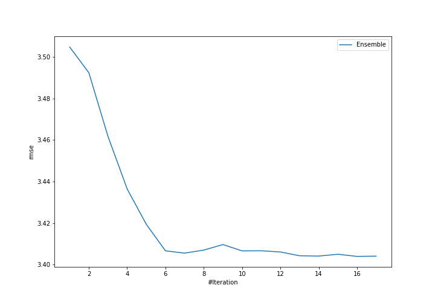
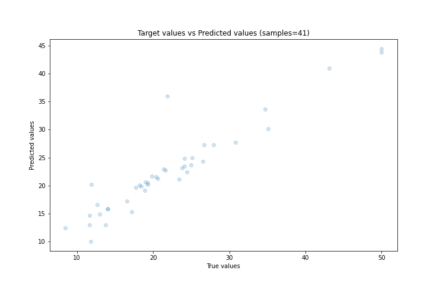
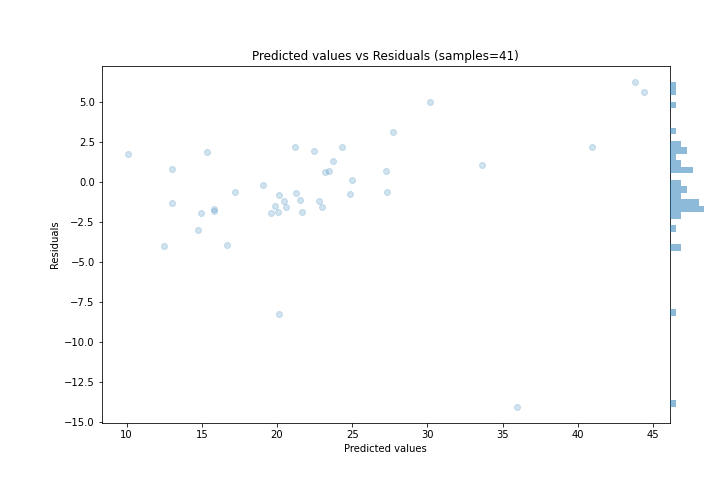

# Summary of Ensemble

[<< Go back](../README.md)

## Ensemble structure
| Model                            |   Weight |
|:---------------------------------|---------:|
| 1_DecisionTree                   |        3 |
| 43_ExtraTrees                    |        2 |
| 5_Default_LightGBM               |        2 |
| 62_Xgboost                       |        1 |
| 6_Default_Xgboost                |        5 |
| 6_Default_Xgboost_GoldenFeatures |        3 |

### Metric details:
| Metric   |     Score |
|:---------|----------:|
| MAE      |  2.30755  |
| MSE      | 11.5867   |
| RMSE     |  3.40393  |
| R2       |  0.869524 |
| MAPE     |  0.122945 |

## Learning curves

## True vs Predicted

## Predicted vs Residuals

[<< Go back](../README.md)
