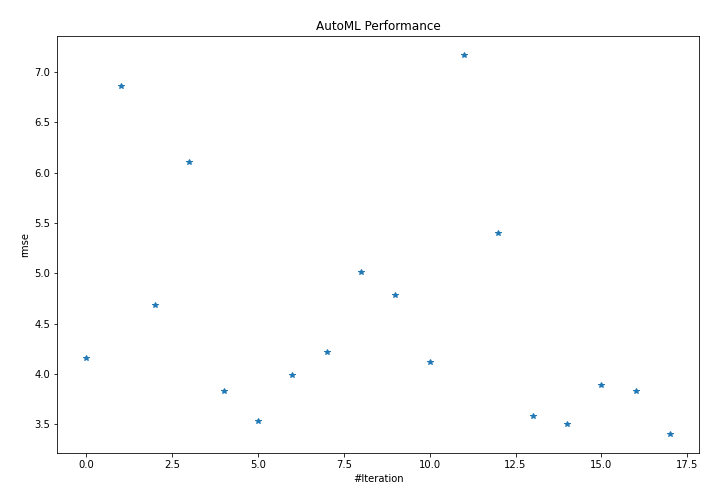
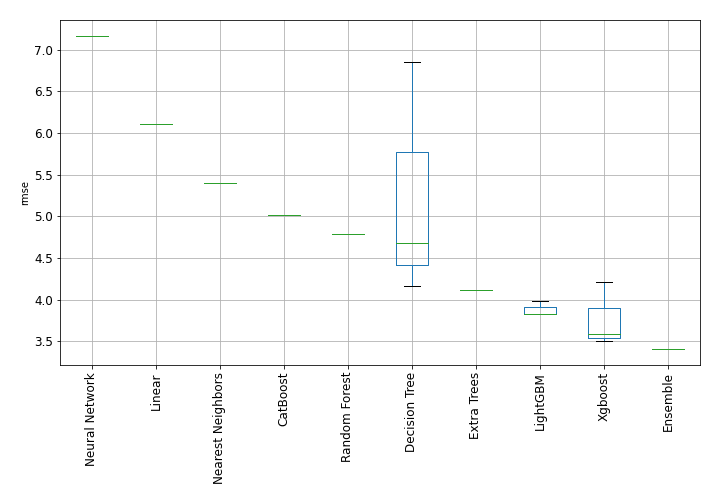
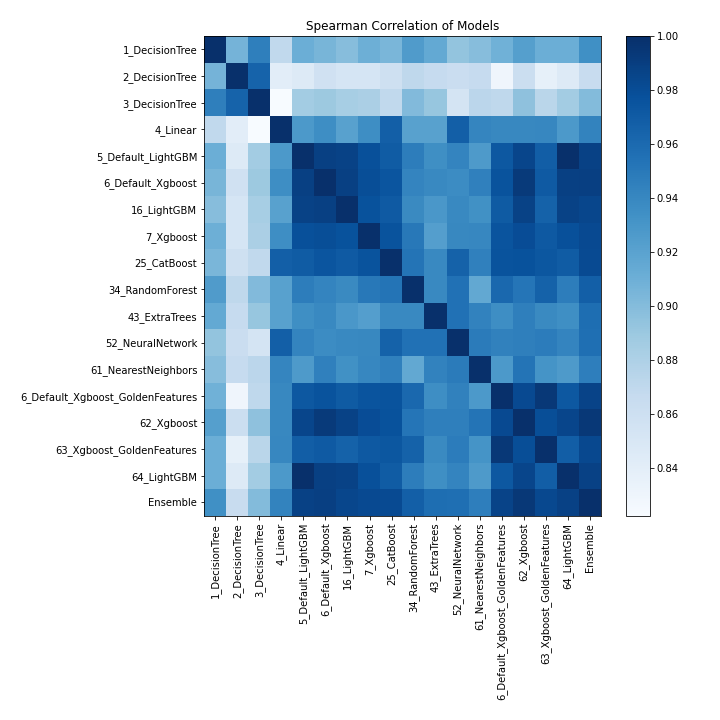

# AutoML Leaderboard

| Best model   | name                                                                           | model_type        | metric_type   |   metric_value |   train_time |
|:-------------|:-------------------------------------------------------------------------------|:------------------|:--------------|---------------:|-------------:|
|              | [1_DecisionTree](1_DecisionTree/README.md)                                     | Decision Tree     | rmse          |        4.16274 |         1.9  |
|              | [2_DecisionTree](2_DecisionTree/README.md)                                     | Decision Tree     | rmse          |        6.85771 |         1.88 |
|              | [3_DecisionTree](3_DecisionTree/README.md)                                     | Decision Tree     | rmse          |        4.68148 |         2    |
|              | [4_Linear](4_Linear/README.md)                                                 | Linear            | rmse          |        6.1061  |         2.23 |
|              | [5_Default_LightGBM](5_Default_LightGBM/README.md)                             | LightGBM          | rmse          |        3.82862 |        17.93 |
|              | [6_Default_Xgboost](6_Default_Xgboost/README.md)                               | Xgboost           | rmse          |        3.5371  |         4.19 |
|              | [16_LightGBM](16_LightGBM/README.md)                                           | LightGBM          | rmse          |        3.98616 |        12.25 |
|              | [7_Xgboost](7_Xgboost/README.md)                                               | Xgboost           | rmse          |        4.21564 |         2.79 |
|              | [25_CatBoost](25_CatBoost/README.md)                                           | CatBoost          | rmse          |        5.01343 |         4.02 |
|              | [34_RandomForest](34_RandomForest/README.md)                                   | Random Forest     | rmse          |        4.78728 |         4.17 |
|              | [43_ExtraTrees](43_ExtraTrees/README.md)                                       | Extra Trees       | rmse          |        4.11655 |         3.13 |
|              | [52_NeuralNetwork](52_NeuralNetwork/README.md)                                 | Neural Network    | rmse          |        7.16891 |         2.03 |
|              | [61_NearestNeighbors](61_NearestNeighbors/README.md)                           | Nearest Neighbors | rmse          |        5.40239 |         3.15 |
|              | [6_Default_Xgboost_GoldenFeatures](6_Default_Xgboost_GoldenFeatures/README.md) | Xgboost           | rmse          |        3.5839  |         7.52 |
|              | [62_Xgboost](62_Xgboost/README.md)                                             | Xgboost           | rmse          |        3.5048  |         7.78 |
|              | [63_Xgboost_GoldenFeatures](63_Xgboost_GoldenFeatures/README.md)               | Xgboost           | rmse          |        3.89445 |         9.53 |
|              | [64_LightGBM](64_LightGBM/README.md)                                           | LightGBM          | rmse          |        3.82862 |        22.12 |
| **the best** | [Ensemble](Ensemble/README.md)                                                 | Ensemble          | rmse          |        3.40393 |         3.56 |

### AutoML Performance

### AutoML Performance Boxplot

### Spearman Correlation of Models

