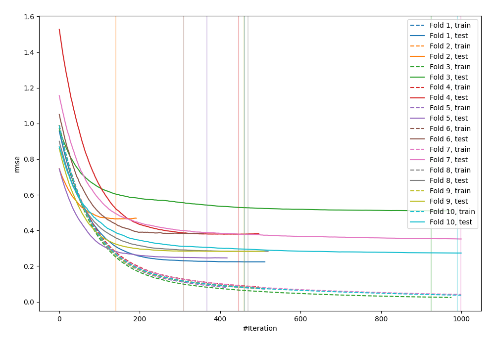
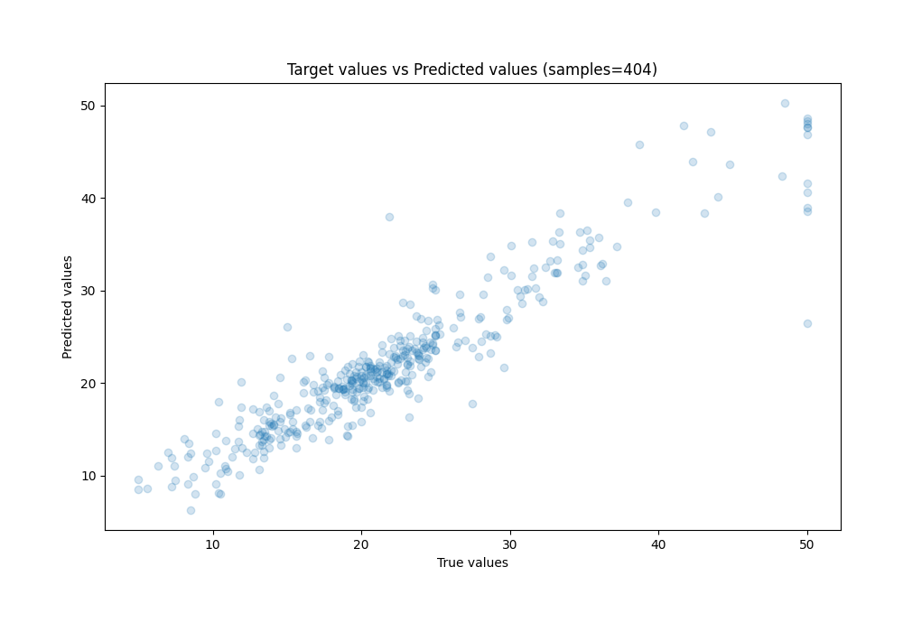
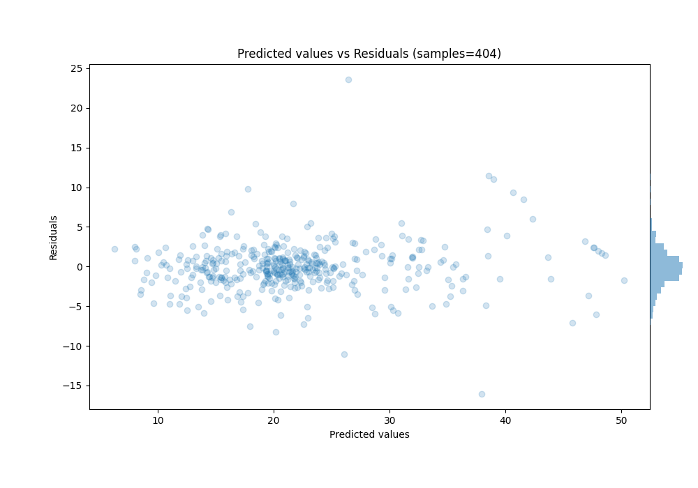

# Summary of 1_Optuna_LightGBM

[<< Go back](../README.md)

## LightGBM
- **n_jobs**: -1
- **objective**: regression
- **num_leaves**: 486
- **learning_rate**: 0.0125
- **feature_fraction**: 0.7499668770201643
- **bagging_fraction**: 0.8164900229317867
- **min_data_in_leaf**: 5
- **metric**: rmse
- **custom_eval_metric_name**: None
- **lambda_l1**: 0.006925639180901979
- **lambda_l2**: 0.0004500555598864005
- **bagging_freq**: 1
- **extra_trees**: False
- **num_boost_round**: 1000
- **early_stopping_rounds**: 50
- **cat_feature**: []
- **feature_pre_filter**: False
- **explain_level**: 0

## Validation
 - **validation_type**: kfold
 - **k_folds**: 10
 - **shuffle**: True

## Optimized metric
rmse

## Training time

298.8 seconds

### Metric details:
| Metric   |    Score |
|:---------|---------:|
| MAE      | 2.08234  |
| MSE      | 9.5172   |
| RMSE     | 3.085    |
| R2       | 0.876337 |
| MAPE     | 0.112322 |

## Learning curves

## True vs Predicted

## Predicted vs Residuals

[<< Go back](../README.md)
