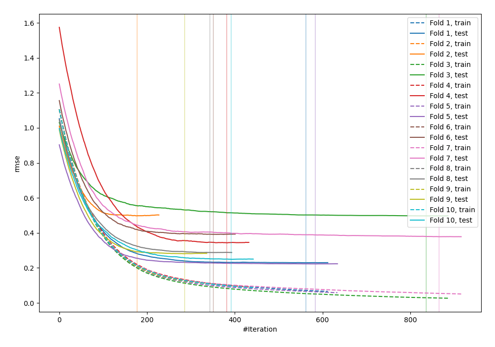
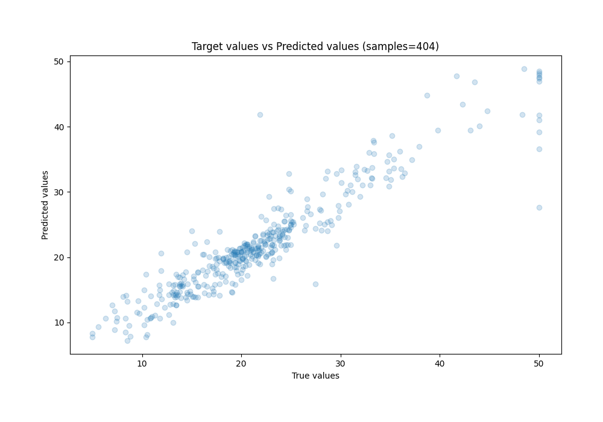
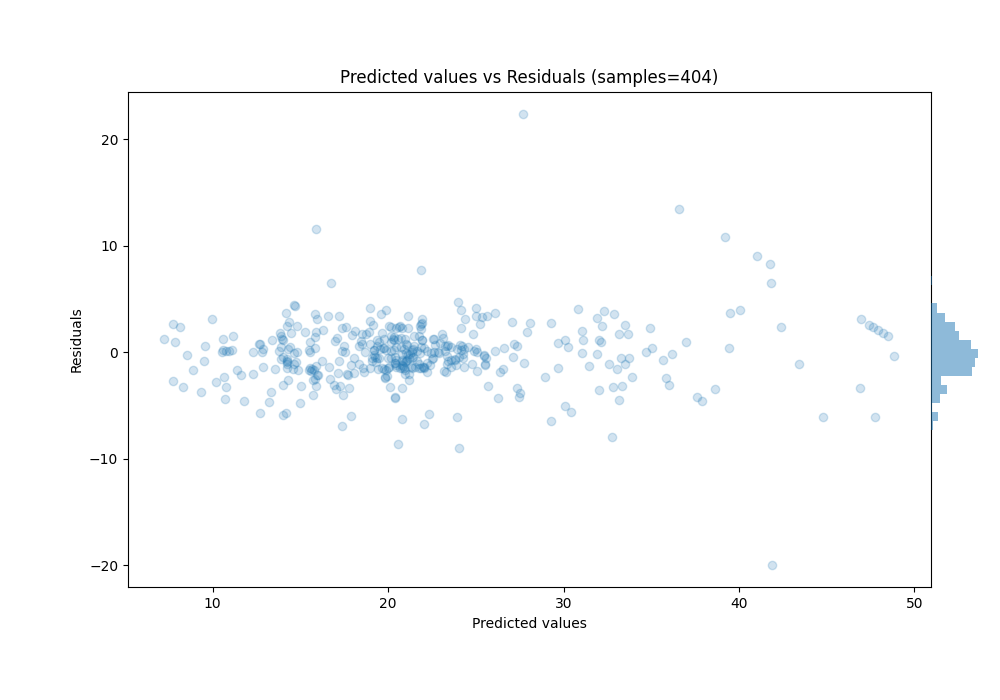

# Summary of 2_Optuna_Xgboost

[<< Go back](../README.md)

## Extreme Gradient Boosting (Xgboost)
- **n_jobs**: -1
- **objective**: reg:squarederror
- **eta**: 0.0125
- **max_depth**: 8
- **min_child_weight**: 2
- **subsample**: 0.47732203253202954
- **colsample_bytree**: 0.9439467767716354
- **eval_metric**: rmse
- **lambda**: 0.00789742283515979
- **alpha**: 3.266185187119584e-06
- **max_rounds**: 1000
- **early_stopping_rounds**: 50
- **explain_level**: 0

## Validation
 - **validation_type**: kfold
 - **k_folds**: 10
 - **shuffle**: True

## Optimized metric
rmse

## Training time

37.7 seconds

### Metric details:
| Metric   |    Score |
|:---------|---------:|
| MAE      | 2.04339  |
| MSE      | 9.52767  |
| RMSE     | 3.08669  |
| R2       | 0.876201 |
| MAPE     | 0.110017 |

## Learning curves

## True vs Predicted

## Predicted vs Residuals

[<< Go back](../README.md)
