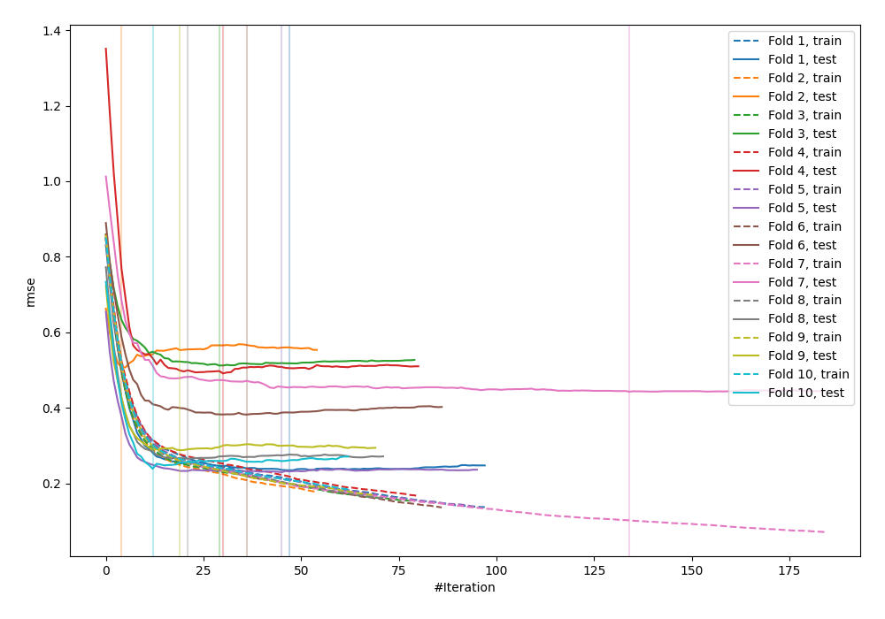
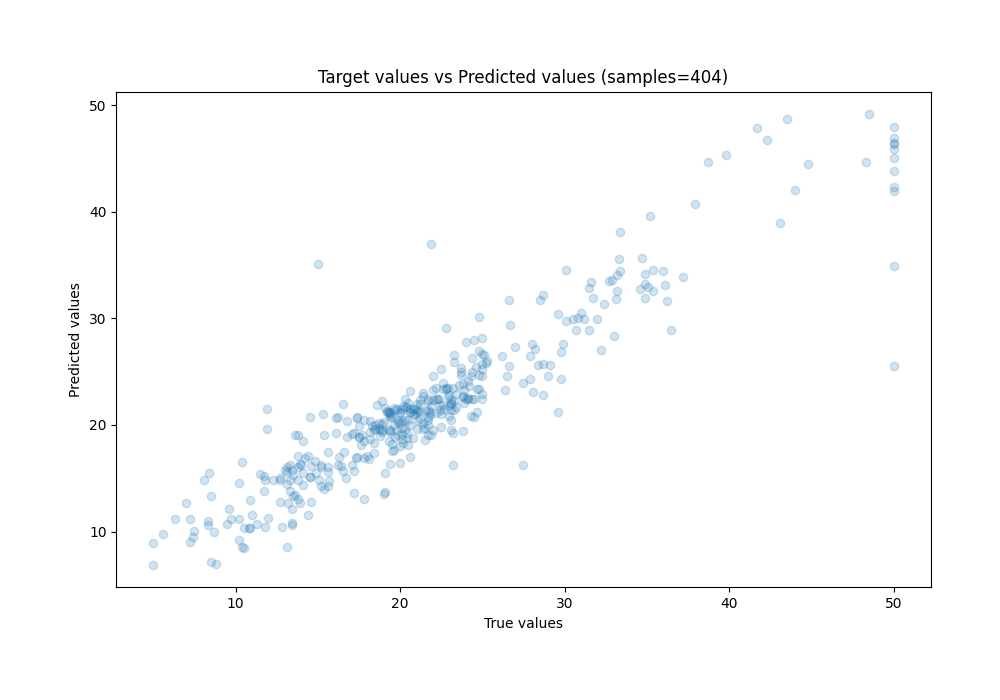
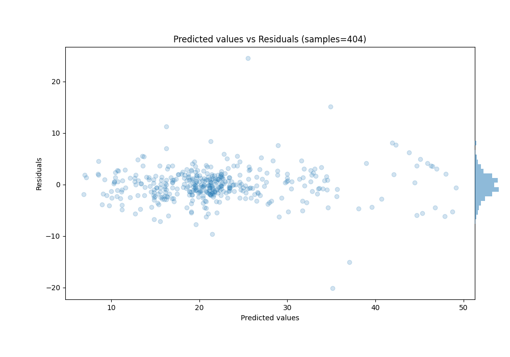

# Summary of 3_Optuna_CatBoost_Stacked

[<< Go back](../README.md)

## CatBoost
- **n_jobs**: -1
- **learning_rate**: 0.2
- **depth**: 4
- **rsm**: 0.6026340876188655
- **loss_function**: RMSE
- **eval_metric**: RMSE
- **l2_leaf_reg**: 1.5395367389239338
- **random_strength**: 0.5355597963917901
- **min_data_in_leaf**: 43
- **num_boost_round**: 1000
- **early_stopping_rounds**: 50
- **explain_level**: 0

## Validation
 - **validation_type**: kfold
 - **k_folds**: 10
 - **shuffle**: True

## Optimized metric
rmse

## Training time

11.8 seconds

### Metric details:
| Metric   |     Score |
|:---------|----------:|
| MAE      |  2.21327  |
| MSE      | 10.844    |
| RMSE     |  3.29303  |
| R2       |  0.859097 |
| MAPE     |  0.119315 |

## Learning curves

## True vs Predicted

## Predicted vs Residuals

[<< Go back](../README.md)
