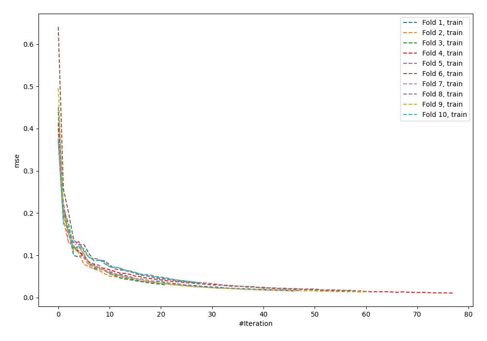
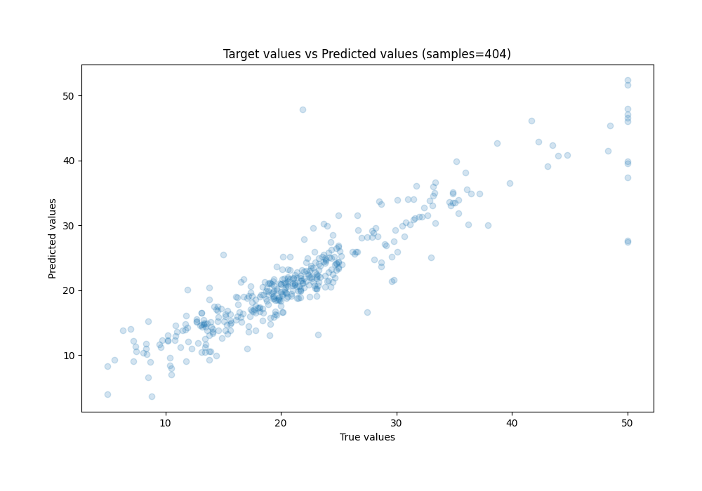
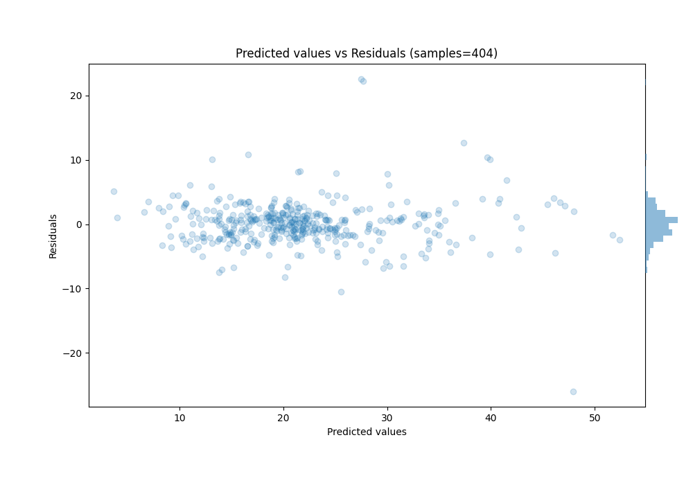

# Summary of 4_Optuna_NeuralNetwork

[<< Go back](../README.md)

## Neural Network
- **n_jobs**: -1
- **dense_1_size**: 91
- **dense_2_size**: 65
- **learning_rate**: 0.005
- **learning_rate_type**: adaptive
- **alpha**: 2.3192732222893343e-07
- **explain_level**: 0

## Validation
 - **validation_type**: kfold
 - **k_folds**: 10
 - **shuffle**: True

## Optimized metric
rmse

## Training time

16.2 seconds

### Metric details:
| Metric   |     Score |
|:---------|----------:|
| MAE      |  2.25789  |
| MSE      | 12.3092   |
| RMSE     |  3.50845  |
| R2       |  0.840059 |
| MAPE     |  0.120196 |

## Learning curves

## True vs Predicted

## Predicted vs Residuals

[<< Go back](../README.md)
