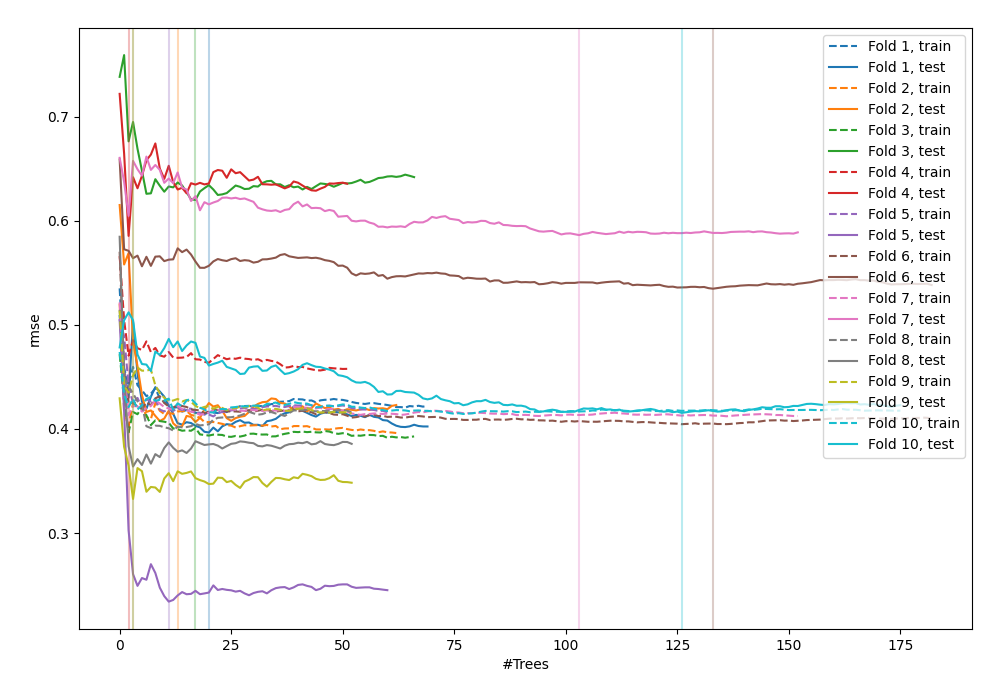
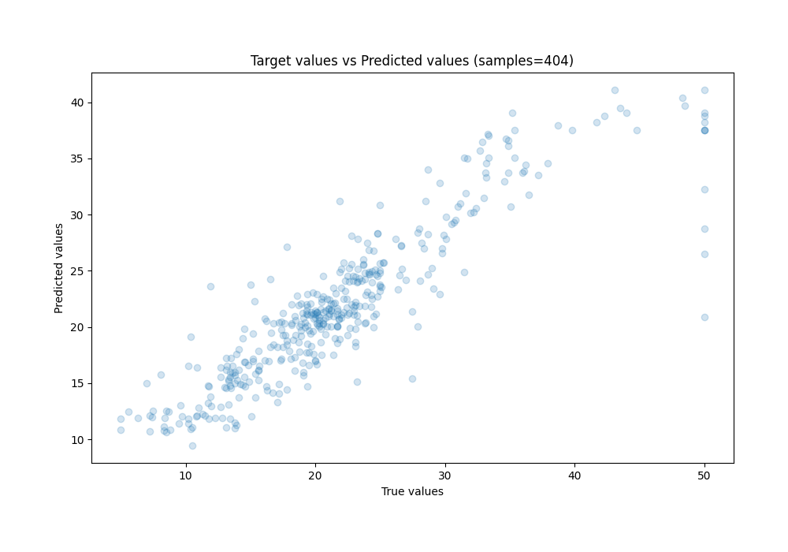
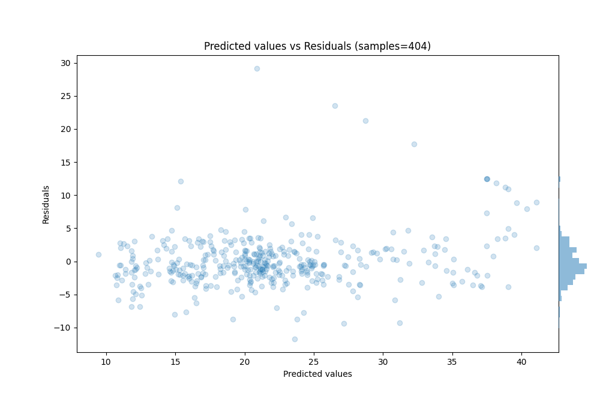

# Summary of 5_Optuna_RandomForest

[<< Go back](../README.md)

## Random Forest
- **n_jobs**: -1
- **criterion**: mse
- **max_features**: 0.42409351770377424
- **min_samples_split**: 2
- **max_depth**: 28
- **eval_metric_name**: rmse
- **min_samples_leaf**: 13
- **max_steps**: 10
- **explain_level**: 0

## Validation
 - **validation_type**: kfold
 - **k_folds**: 10
 - **shuffle**: True

## Optimized metric
rmse

## Training time

27.8 seconds

### Metric details:
| Metric   |     Score |
|:---------|----------:|
| MAE      |  2.6225   |
| MSE      | 16.2757   |
| RMSE     |  4.03431  |
| R2       |  0.78852  |
| MAPE     |  0.138729 |

## Learning curves

## True vs Predicted

## Predicted vs Residuals

[<< Go back](../README.md)
