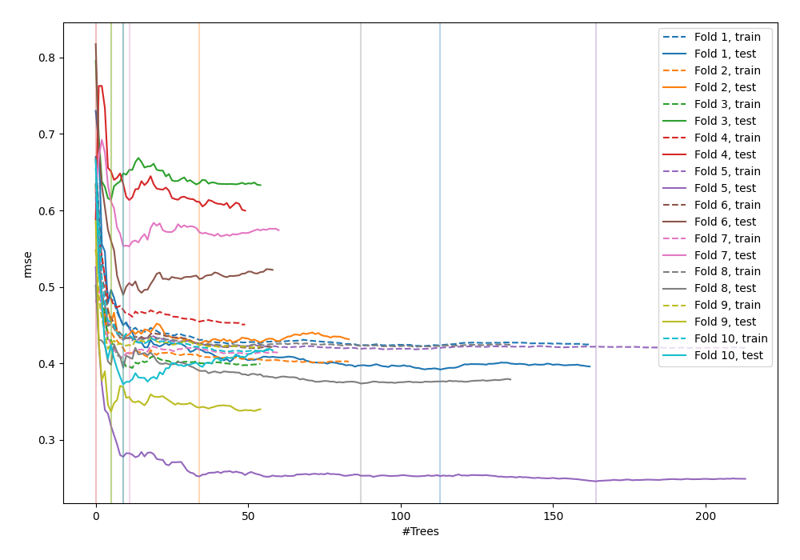
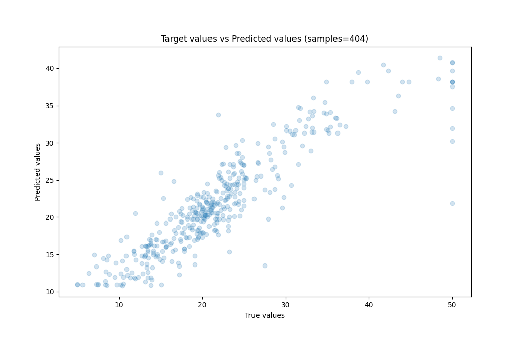
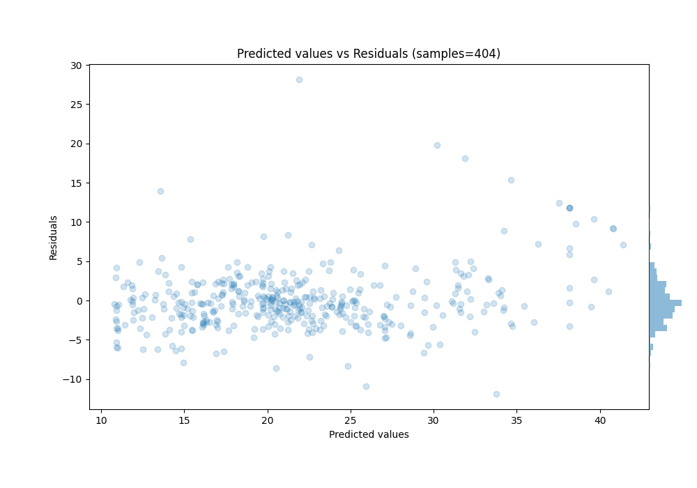

# Summary of 6_Optuna_ExtraTrees

[<< Go back](../README.md)

## Extra Trees Regressor (Extra Trees)
- **n_jobs**: -1
- **criterion**: mse
- **max_features**: 0.8511688485675506
- **min_samples_split**: 43
- **max_depth**: 28
- **eval_metric_name**: rmse
- **min_samples_leaf**: 8
- **max_steps**: 10
- **explain_level**: 0

## Validation
 - **validation_type**: kfold
 - **k_folds**: 10
 - **shuffle**: True

## Optimized metric
rmse

## Training time

25.8 seconds

### Metric details:
| Metric   |     Score |
|:---------|----------:|
| MAE      |  2.62117  |
| MSE      | 15.6056   |
| RMSE     |  3.9504   |
| R2       |  0.797226 |
| MAPE     |  0.138264 |

## Learning curves

## True vs Predicted

## Predicted vs Residuals

[<< Go back](../README.md)
