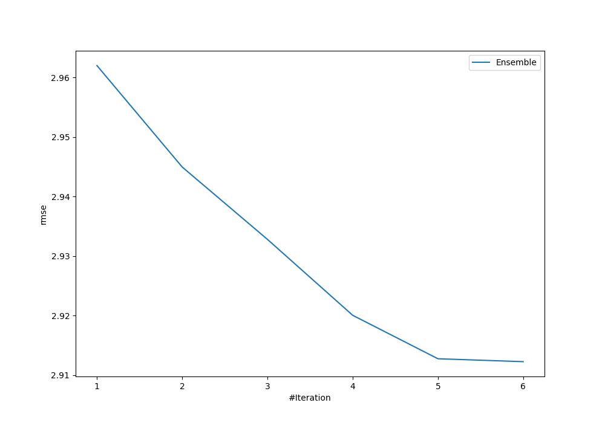
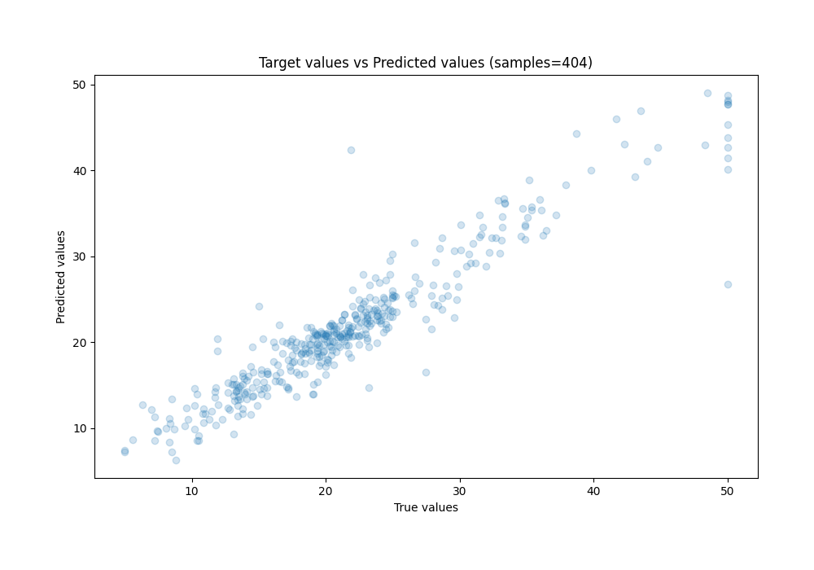
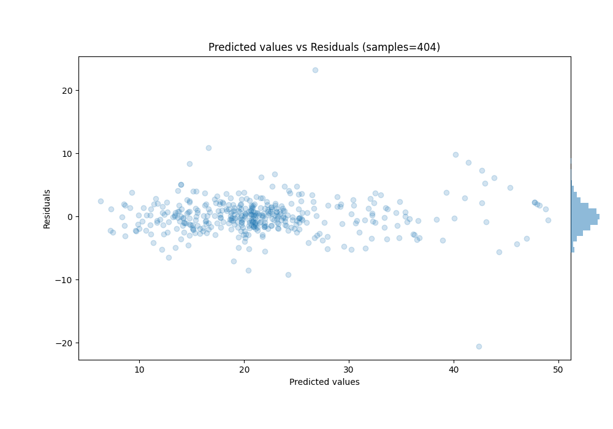

# Summary of Ensemble

[<< Go back](../README.md)

## Ensemble structure
| Model                  |   Weight |
|:-----------------------|---------:|
| 1_Optuna_LightGBM      |        1 |
| 3_Optuna_CatBoost      |        4 |
| 4_Optuna_NeuralNetwork |        1 |

### Metric details:
| Metric   |    Score |
|:---------|---------:|
| MAE      | 1.92105  |
| MSE      | 8.48114  |
| RMSE     | 2.91224  |
| R2       | 0.889799 |
| MAPE     | 0.101445 |

## Learning curves

## True vs Predicted

## Predicted vs Residuals

[<< Go back](../README.md)
