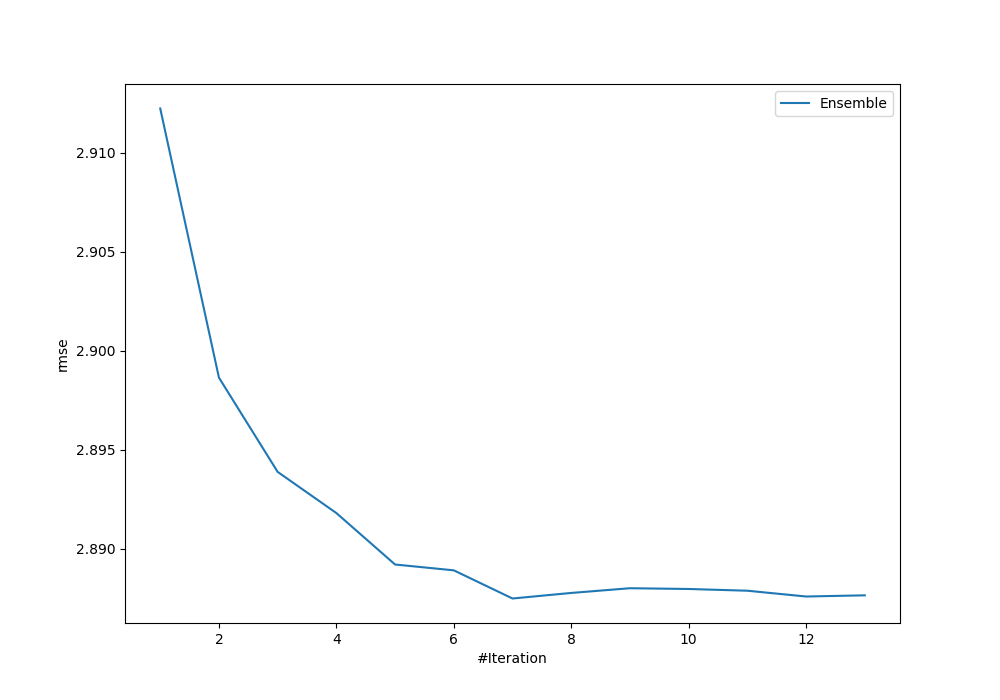
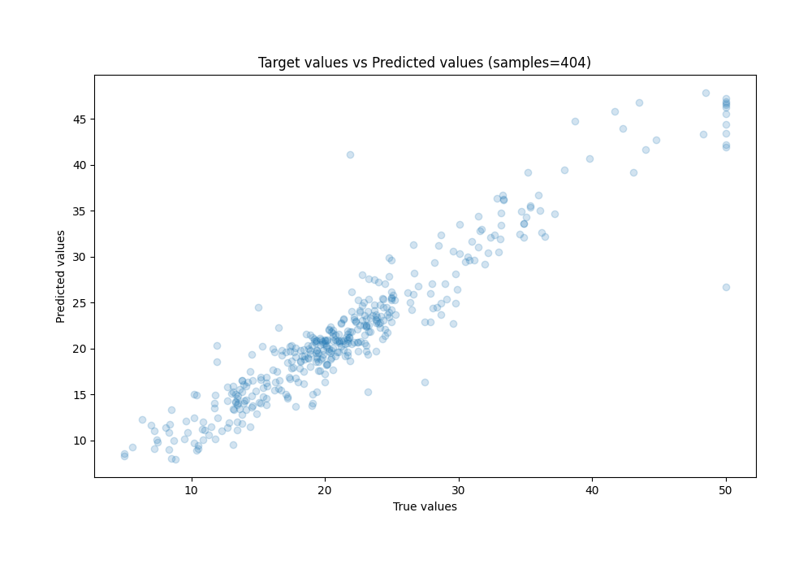
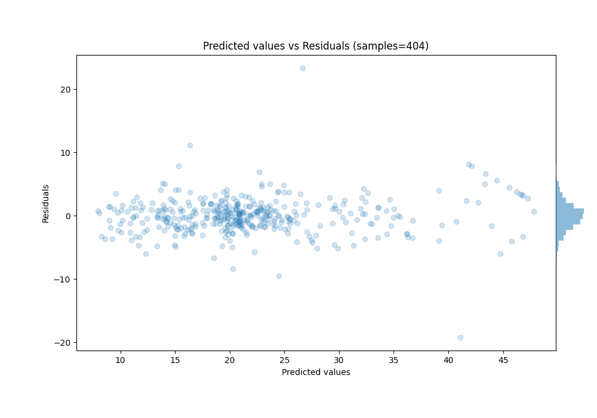

# Summary of Ensemble_Stacked

[<< Go back](../README.md)

## Ensemble structure
| Model                       |   Weight |
|:----------------------------|---------:|
| 1_Optuna_LightGBM_Stacked   |        1 |
| 3_Optuna_CatBoost           |        1 |
| 6_Optuna_ExtraTrees_Stacked |        2 |
| Ensemble                    |        3 |

### Metric details:
| Metric   |    Score |
|:---------|---------:|
| MAE      | 1.94161  |
| MSE      | 8.33755  |
| RMSE     | 2.88748  |
| R2       | 0.891665 |
| MAPE     | 0.103487 |

## Learning curves

## True vs Predicted

## Predicted vs Residuals

[<< Go back](../README.md)
