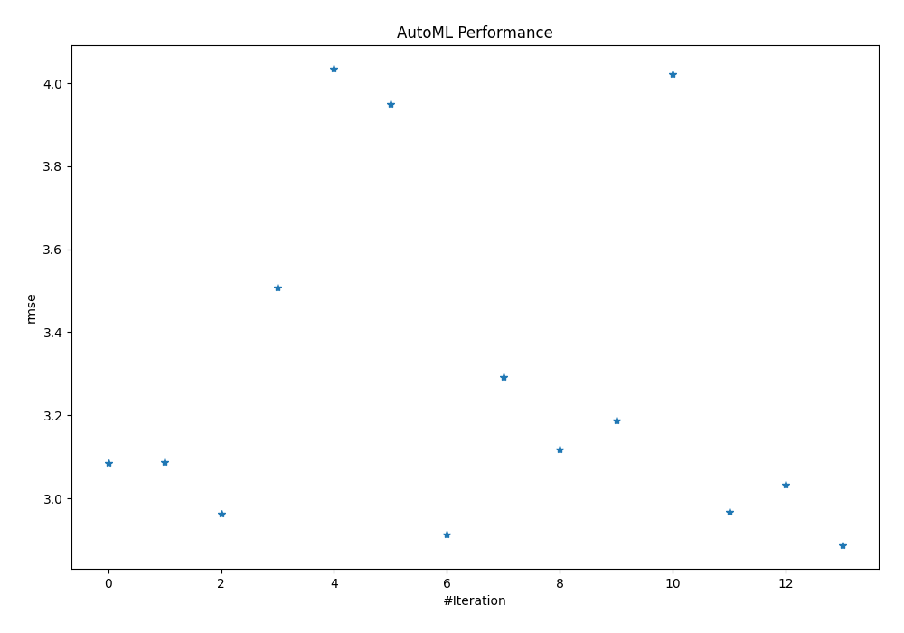
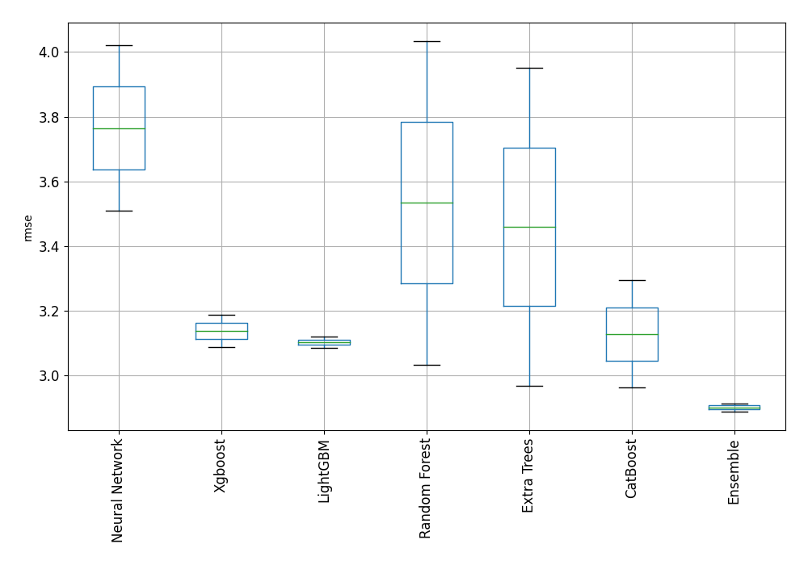
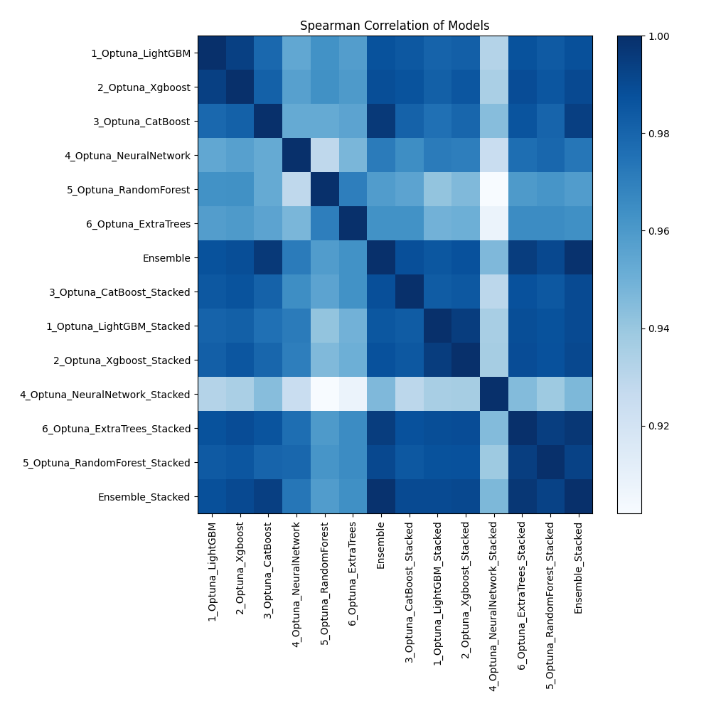

# AutoML Leaderboard

| Best model   | name                                                                       | model_type     | metric_type   |   metric_value |   train_time |
|:-------------|:---------------------------------------------------------------------------|:---------------|:--------------|---------------:|-------------:|
|              | [1_Optuna_LightGBM](1_Optuna_LightGBM/README.md)                           | LightGBM       | rmse          |        3.085   |       301.15 |
|              | [2_Optuna_Xgboost](2_Optuna_Xgboost/README.md)                             | Xgboost        | rmse          |        3.08669 |        39.86 |
|              | [3_Optuna_CatBoost](3_Optuna_CatBoost/README.md)                           | CatBoost       | rmse          |        2.96199 |        13.64 |
|              | [4_Optuna_NeuralNetwork](4_Optuna_NeuralNetwork/README.md)                 | Neural Network | rmse          |        3.50845 |        18.11 |
|              | [5_Optuna_RandomForest](5_Optuna_RandomForest/README.md)                   | Random Forest  | rmse          |        4.03431 |        30.16 |
|              | [6_Optuna_ExtraTrees](6_Optuna_ExtraTrees/README.md)                       | Extra Trees    | rmse          |        3.9504  |        28.17 |
|              | [Ensemble](Ensemble/README.md)                                             | Ensemble       | rmse          |        2.91224 |         0.94 |
|              | [3_Optuna_CatBoost_Stacked](3_Optuna_CatBoost_Stacked/README.md)           | CatBoost       | rmse          |        3.29303 |        13.98 |
|              | [1_Optuna_LightGBM_Stacked](1_Optuna_LightGBM_Stacked/README.md)           | LightGBM       | rmse          |        3.11866 |       292.27 |
|              | [2_Optuna_Xgboost_Stacked](2_Optuna_Xgboost_Stacked/README.md)             | Xgboost        | rmse          |        3.18738 |        46.06 |
|              | [4_Optuna_NeuralNetwork_Stacked](4_Optuna_NeuralNetwork_Stacked/README.md) | Neural Network | rmse          |        4.02128 |        23.2  |
|              | [6_Optuna_ExtraTrees_Stacked](6_Optuna_ExtraTrees_Stacked/README.md)       | Extra Trees    | rmse          |        2.9679  |        22.97 |
|              | [5_Optuna_RandomForest_Stacked](5_Optuna_RandomForest_Stacked/README.md)   | Random Forest  | rmse          |        3.0331  |        18.9  |
| **the best** | [Ensemble_Stacked](Ensemble_Stacked/README.md)                             | Ensemble       | rmse          |        2.88748 |         1.78 |

### AutoML Performance

### AutoML Performance Boxplot

### Spearman Correlation of Models

