# Optuna tuning for LightGBM on original data

## LightGBM Optimization History

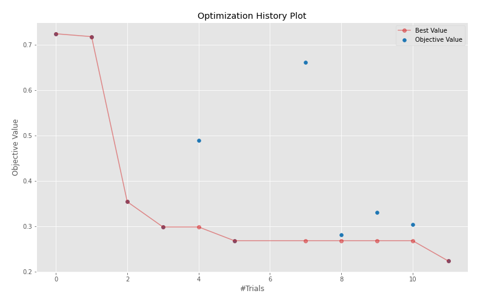

## LightGBM Parallel Coordinate

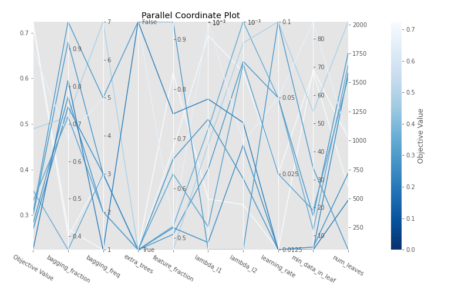

## LightGBM Param Importances

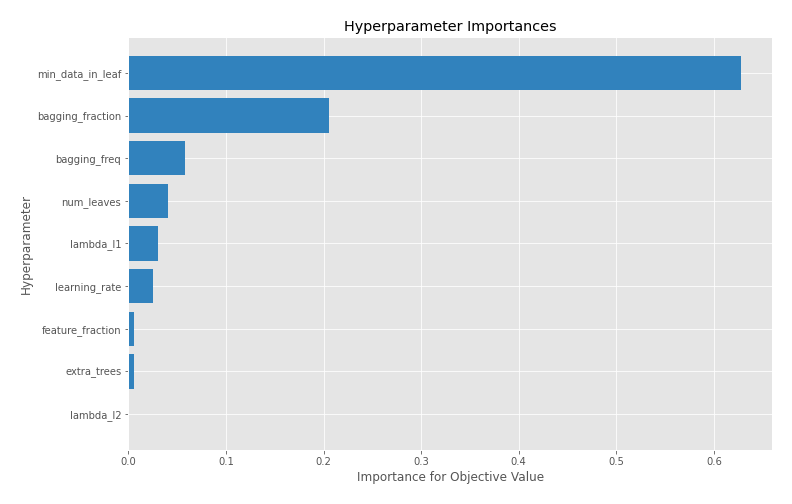

[<< Go back](../README.md)
# Optuna tuning for Xgboost on original data

## Xgboost Optimization History

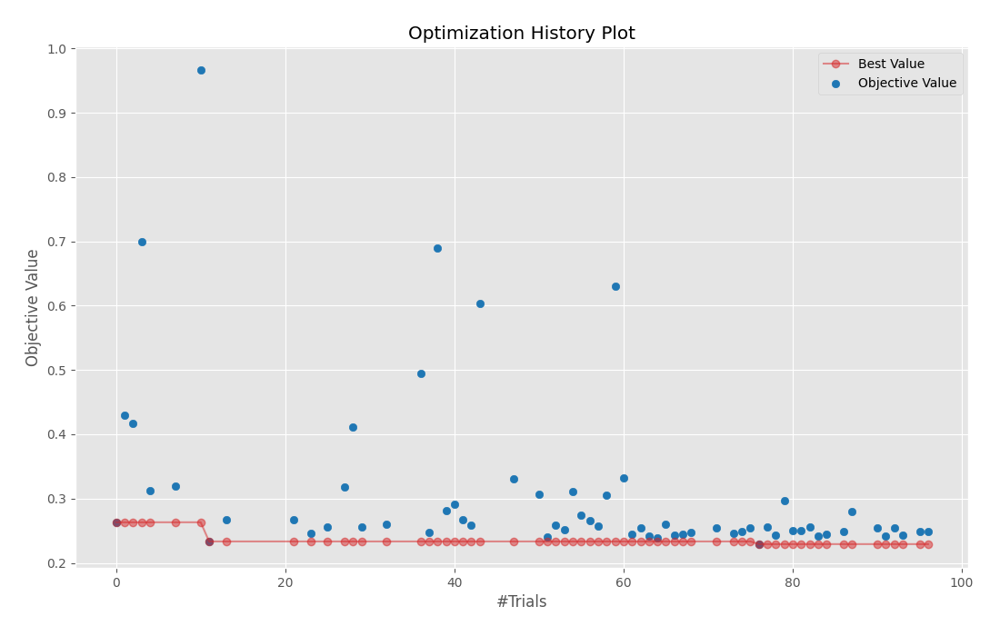

## Xgboost Param Importances

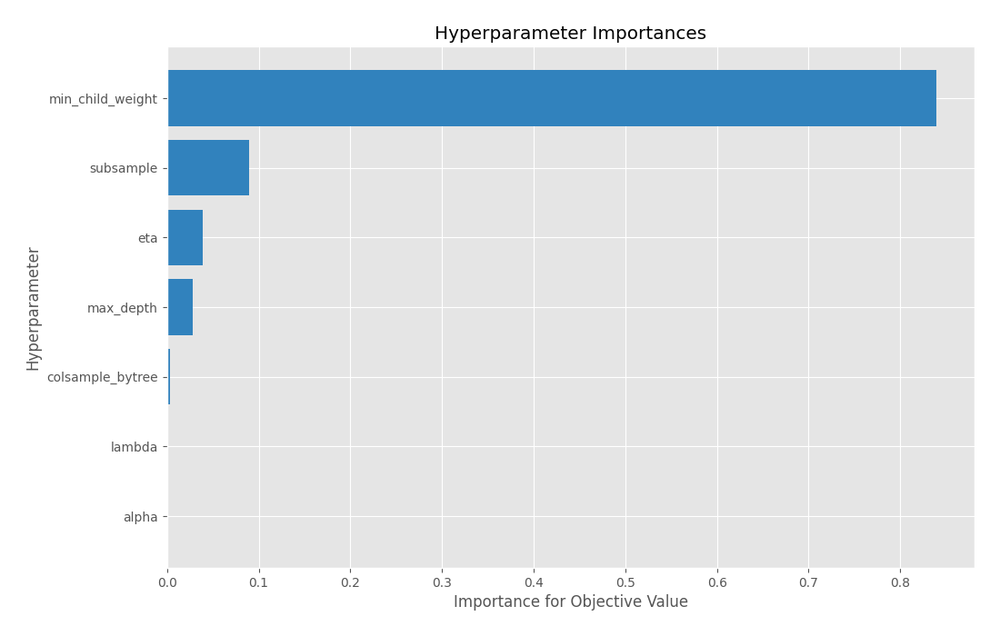

[<< Go back](../README.md)
# Optuna tuning for CatBoost on original data

## CatBoost Optimization History

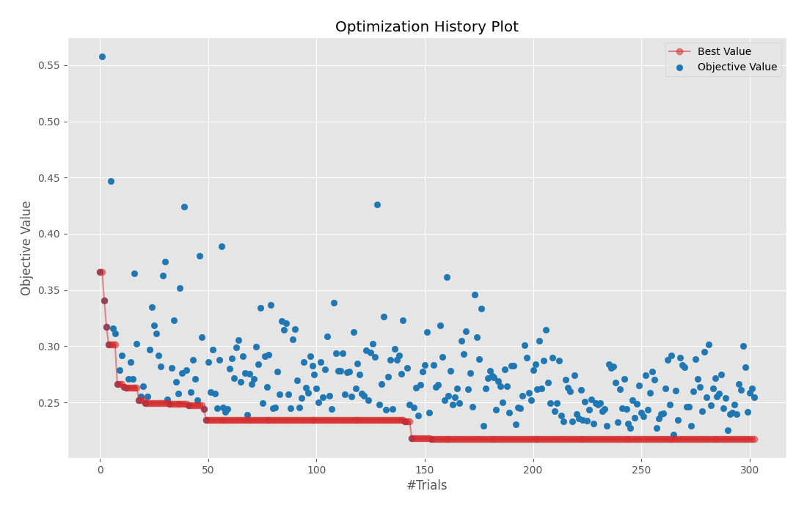

## CatBoost Parallel Coordinate

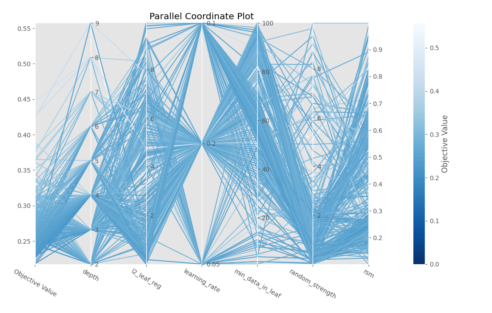

## CatBoost Param Importances

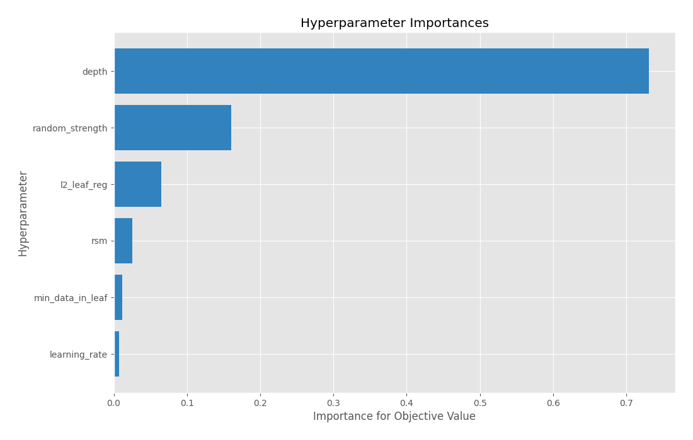

[<< Go back](../README.md)
# Optuna tuning for Neural Network on original data

## Neural Network Optimization History

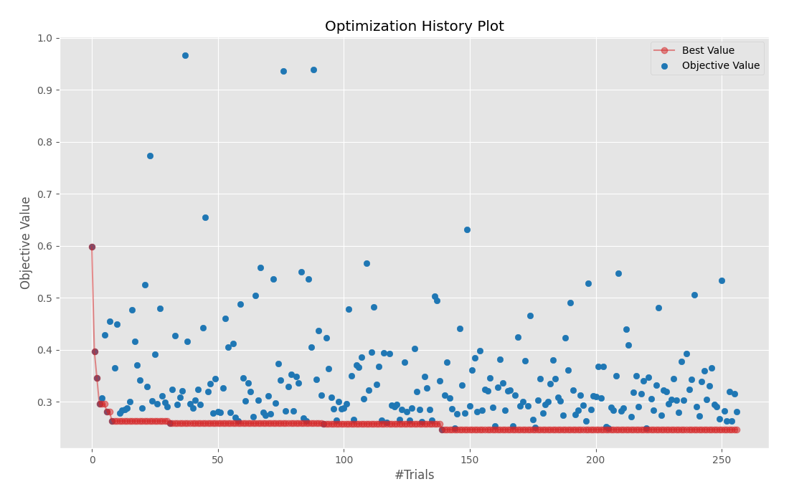

## Neural Network Parallel Coordinate

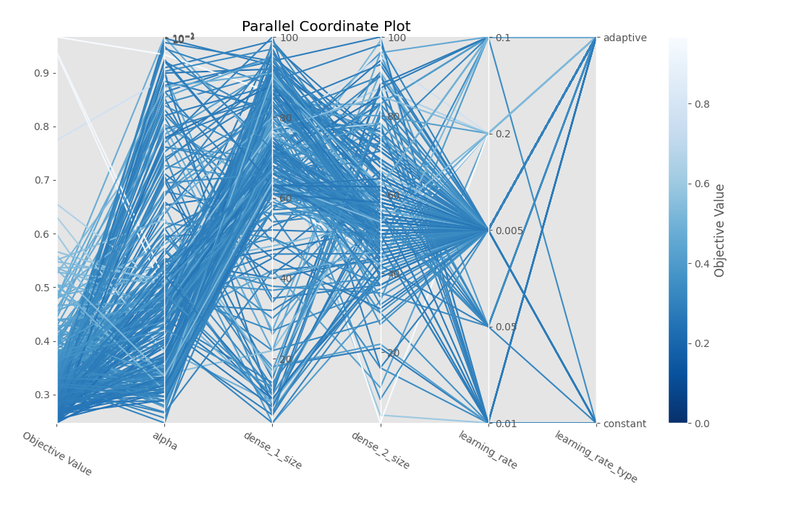

## Neural Network Param Importances

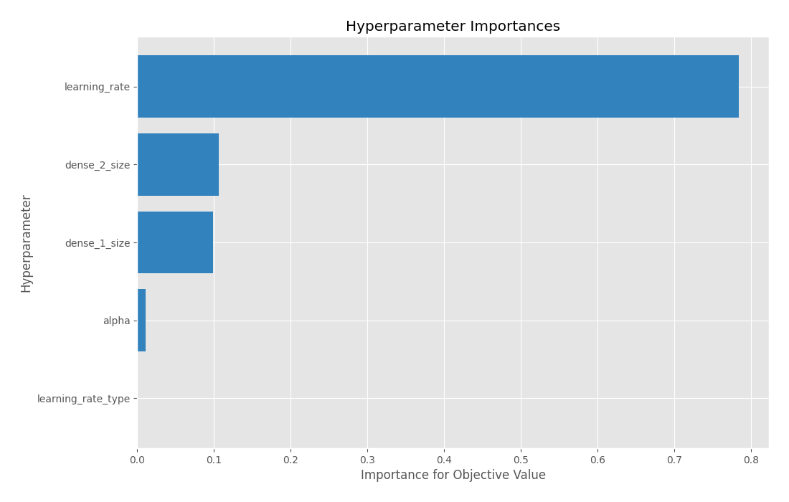

[<< Go back](../README.md)
# Optuna tuning for Random Forest on original data

## Random Forest Optimization History

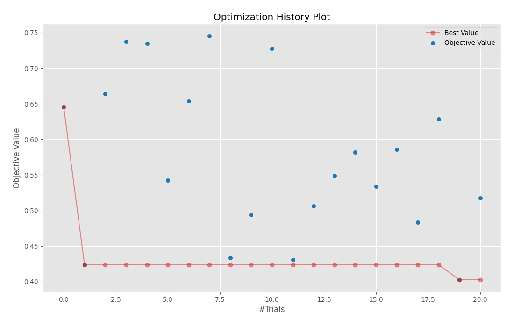

## Random Forest Parallel Coordinate

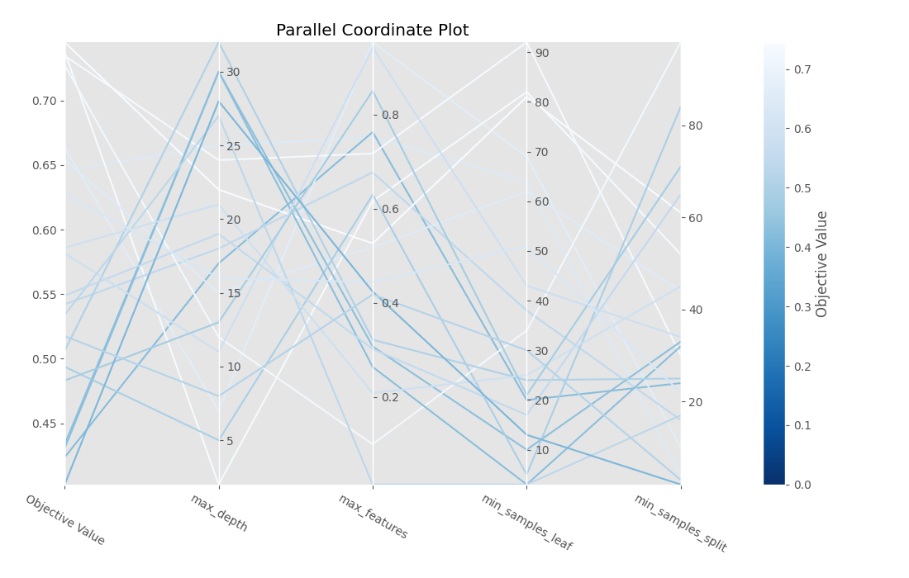

## Random Forest Param Importances

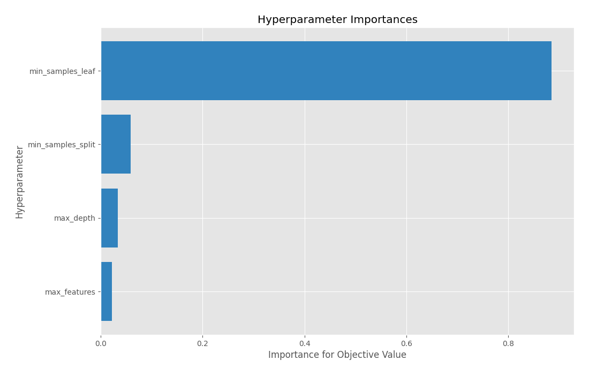

[<< Go back](../README.md)
# Optuna tuning for Extra Trees on original data

## Extra Trees Optimization History

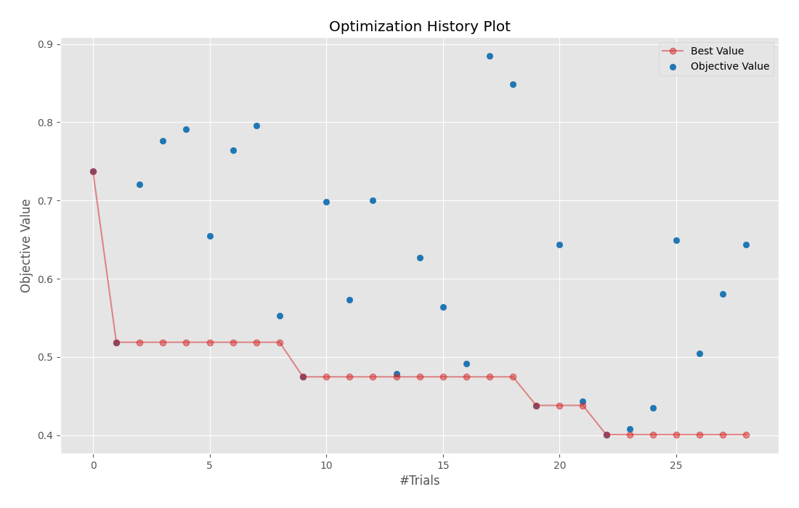

## Extra Trees Parallel Coordinate

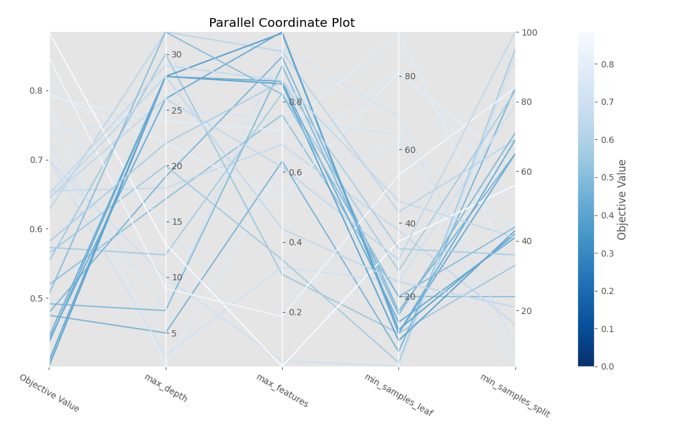

## Extra Trees Param Importances

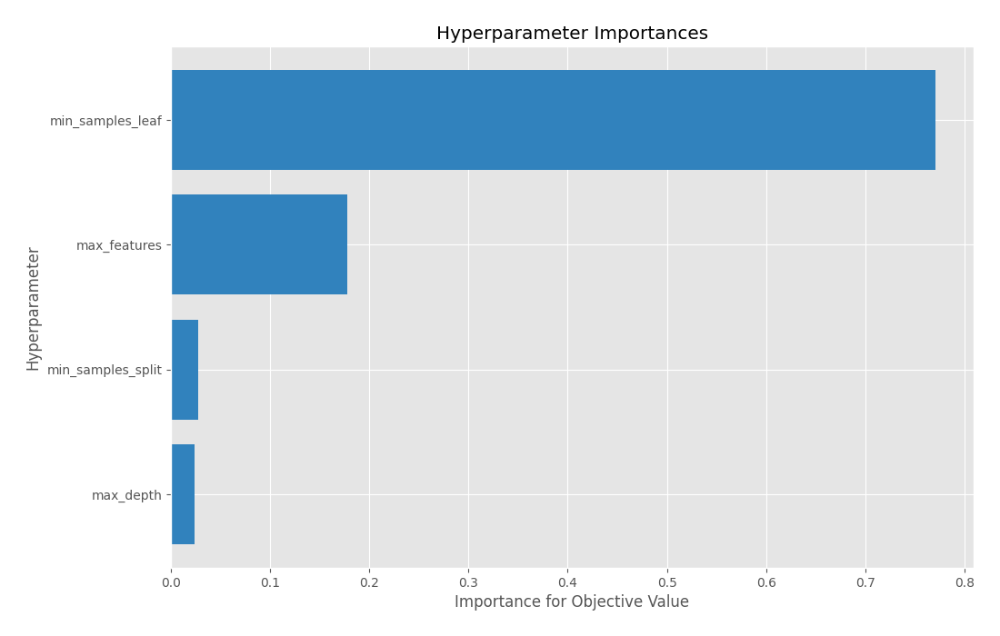

[<< Go back](../README.md)
